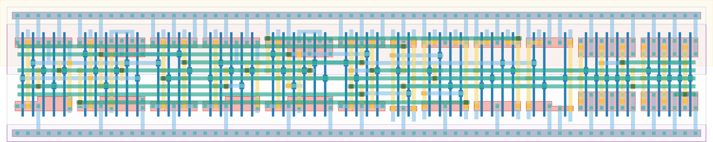

# `async_control_0` Module


## Cell Hierarchy

`async_control_0` **47** (number MOS pairs)
- `dff_st_ar` **15** *x2*
- `nand2` **2** *x5*
- `inv` **1** *x3*
- `buffer` **2** *x2*

## Netlist

```
.SUBCKT async_control_0 clk mero_e2l mero_en rst rst' state<0> state<1> sta_ready tdc_ready trng_rst
                        + vdd vss
    Xi1 clk nextstate<1> state<1> trng_rst rst rst' vdd vss dff_st_ar
    Xi0 clk nextstate<0> state<0> state'<0> rst rst' vdd vss dff_st_ar
    Xi8 state'<0> state<1> net08 vdd vss nand2
    Xi7 state1_int state'<0> nextstate<1> vdd vss nand2
    Xi6 state<1> tdc_ready' state1_int vdd vss nand2
    Xi3 state0_int state<1> nextstate<0> vdd vss nand2
    Xi2 state<0> sta_ready' state0_int vdd vss nand2
    Xi9 net08 mero_e2l_i vdd vss inv
    Xi5 tdc_ready tdc_ready' vdd vss inv
    Xi4 sta_ready sta_ready' vdd vss inv
    Xi11 state<1> mero_en vdd vss buffer
    Xi10 mero_e2l_i mero_e2l vdd vss buffer
.ENDS
```
