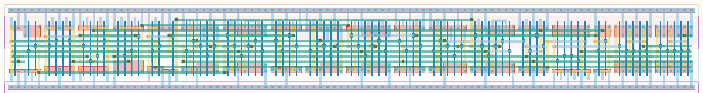

# `async_control_1` Module


## Cell Hierarchy

`async_control_1` **74** (number MOS pairs)
- `dff_st_ar` **15** *x3*
- `nor2` **2** *x3*
- `nand2` **2** *x5*
- `nand4` **4**
- `inv` **1** *x2*
- `nor3` **3**
- `buffer` **2** *x2*

## Netlist

```
.SUBCKT async_control_1 clk clk_en clk_ready ctrl_rst data_ready rst rst' ser_ready state<0>
                        + state<1> state<2> vdd vss
    Xi2 clk nextstate<2> state<2> state'<2> rst rst' vdd vss dff_st_ar
    Xi1 clk nextstate<1> state<1> state'<1> rst rst' vdd vss dff_st_ar
    Xi0 clk nextstate<0> state<0> state'<0> rst rst' vdd vss dff_st_ar
    Xi15 state'<1> state'<2> data_ready_i vdd vss nor2
    Xi13 state<1> state<2> clk_en_i vdd vss nor2
    Xi3 state<1> state<2> nextstate<0> vdd vss nor2
    Xi9 state'<0> state<1> net05 vdd vss nand2
    Xi7 state<0> clk_ready state1_int<3> vdd vss nand2
    Xi6 state<1> state'<2> state1_int<2> vdd vss nand2
    Xi5 state<0> state<1> state1_int<1> vdd vss nand2
    Xi4 state<1> ser_ready' state1_int<0> vdd vss nand2
    Xi8 state1_int<0> state1_int<1> state1_int<2> state1_int<3> nextstate<1> vdd vss nand4
    Xi11 ser_ready ser_ready' vdd vss inv
    Xi10 net05 nextstate<2> vdd vss inv
    Xi14 state<0> state<1> state<2> ctrl_rst vdd vss nor3
    Xi17 data_ready_i data_ready vdd vss buffer
    Xi16 clk_en_i clk_en vdd vss buffer
.ENDS
```
