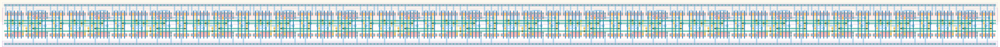

# `async_counter_16` Module


## Cell Hierarchy

`async_counter_16` **240** (number MOS pairs)
- `async_counter_8` **120** *x2*

## Netlist

```
.SUBCKT async_counter_16 clk out<0> out<1> out<2> out<3> out<4> out<5> out<6> out<7> out<8> out<9>
                         + out<10> out<11> out<12> out<13> out<14> out<15> q' rst rst' vdd vss
    Xi1 net12 out<8> out<9> out<10> out<11> out<12> out<13> out<14> out<15> q' rst rst' vdd vss
        + async_counter_8
    Xi0 clk out<0> out<1> out<2> out<3> out<4> out<5> out<6> out<7> net12 rst rst' vdd vss
        + async_counter_8
.ENDS
```
