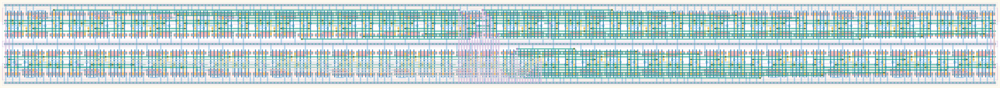

# `async_counter_32` Module


## Cell Hierarchy

`async_counter_32` **480** (number MOS pairs)
- `async_counter_16` **240** *x2*

## Netlist

```
.SUBCKT async_counter_32 clk out<0> out<1> out<2> out<3> out<4> out<5> out<6> out<7> out<8> out<9>
                         + out<10> out<11> out<12> out<13> out<14> out<15> out<16> out<17> out<18>
                         + out<19> out<20> out<21> out<22> out<23> out<24> out<25> out<26> out<27>
                         + out<28> out<29> out<30> out<31> q' rst rst' vdd vss
    Xi1 net7 out<16> out<17> out<18> out<19> out<20> out<21> out<22> out<23> out<24> out<25> out<26>
        + out<27> out<28> out<29> out<30> out<31> q' rst rst' vdd vss async_counter_16
    Xi0 clk out<0> out<1> out<2> out<3> out<4> out<5> out<6> out<7> out<8> out<9> out<10> out<11>
        + out<12> out<13> out<14> out<15> net7 rst rst' vdd vss async_counter_16
.ENDS
```
