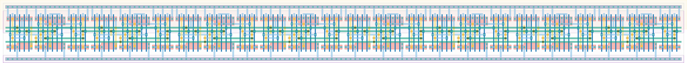

# `async_counter_8` Module


## Cell Hierarchy

`async_counter_8` **120** (number MOS pairs)
- `tff_st_ar` **15** *x8*

## Netlist

```
.SUBCKT async_counter_8 clk out<0> out<1> out<2> out<3> out<4> out<5> out<6> out<7> q' rst rst' vdd
                        + vss
    Xi7 net4 out<4> net5 rst rst' vdd vss tff_st_ar
    Xi6 net6 out<6> net7 rst rst' vdd vss tff_st_ar
    Xi5 net7 out<7> q' rst rst' vdd vss tff_st_ar
    Xi4 net5 out<5> net6 rst rst' vdd vss tff_st_ar
    Xi3 net2 out<2> net3 rst rst' vdd vss tff_st_ar
    Xi2 net3 out<3> net4 rst rst' vdd vss tff_st_ar
    Xi1 net1 out<1> net2 rst rst' vdd vss tff_st_ar
    Xi0 clk out<0> net1 rst rst' vdd vss tff_st_ar
.ENDS
```
