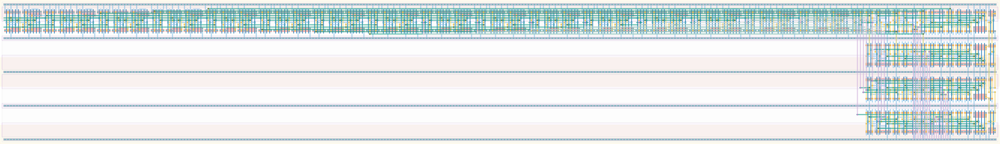

# `async_counter_equal_16` Module


## Cell Hierarchy

`async_counter_equal_16` **359** (number MOS pairs)
- `async_counter_16` **240**
- `check_equal_16` **119**

## Netlist

```
.SUBCKT async_counter_equal_16 clk conf_equal<0> conf_equal<1> conf_equal<2> conf_equal<3>
                               + conf_equal<4> conf_equal<5> conf_equal<6> conf_equal<7>
                               + conf_equal<8> conf_equal<9> conf_equal<10> conf_equal<11>
                               + conf_equal<12> conf_equal<13> conf_equal<14> conf_equal<15> equal
                               + rst rst' vdd vss
    Xi0 clk cnt<0> cnt<1> cnt<2> cnt<3> cnt<4> cnt<5> cnt<6> cnt<7> cnt<8> cnt<9> cnt<10> cnt<11>
        + cnt<12> cnt<13> cnt<14> cnt<15> net13 rst rst' vdd vss async_counter_16
    Xi1 equal cnt<0> cnt<1> cnt<2> cnt<3> cnt<4> cnt<5> cnt<6> cnt<7> cnt<8> cnt<9> cnt<10> cnt<11>
        + cnt<12> cnt<13> cnt<14> cnt<15> conf_equal<0> conf_equal<1> conf_equal<2> conf_equal<3>
        + conf_equal<4> conf_equal<5> conf_equal<6> conf_equal<7> conf_equal<8> conf_equal<9>
        + conf_equal<10> conf_equal<11> conf_equal<12> conf_equal<13> conf_equal<14> conf_equal<15>
        + vdd vss check_equal_16
.ENDS
```
