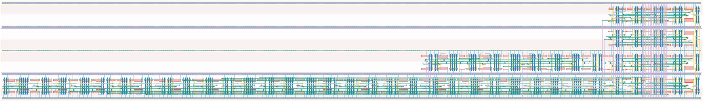

# `async_datapath_0` Module


## Cell Hierarchy

`async_datapath_0` **430** (number MOS pairs)
- `synchronizer` **34** *x2*
- `nand2` **2**
- `inv` **1**
- `async_counter_equal_16` **359**

## Netlist

```
.SUBCKT async_datapath_0 clk conf_statecnt<0> conf_statecnt<1> conf_statecnt<2> conf_statecnt<3>
                         + conf_statecnt<4> conf_statecnt<5> conf_statecnt<6> conf_statecnt<7>
                         + conf_statecnt<8> conf_statecnt<9> conf_statecnt<10> conf_statecnt<11>
                         + conf_statecnt<12> conf_statecnt<13> conf_statecnt<14> conf_statecnt<15>
                         + rst rst' sta_ready tdc0_ready tdc1_ready tdc_ready vdd vss
    Xi1 clk tdc1_ready tdc1_sync rst rst' vdd vss synchronizer
    Xi0 clk tdc0_ready tdc0_sync rst rst' vdd vss synchronizer
    Xi2 tdc0_sync tdc1_sync net7 vdd vss nand2
    Xi3 net7 tdc_ready vdd vss inv
    Xi5 clk conf_statecnt<0> conf_statecnt<1> conf_statecnt<2> conf_statecnt<3> conf_statecnt<4>
        + conf_statecnt<5> conf_statecnt<6> conf_statecnt<7> conf_statecnt<8> conf_statecnt<9>
        + conf_statecnt<10> conf_statecnt<11> conf_statecnt<12> conf_statecnt<13> conf_statecnt<14>
        + conf_statecnt<15> sta_ready rst rst' vdd vss async_counter_equal_16
.ENDS
```
