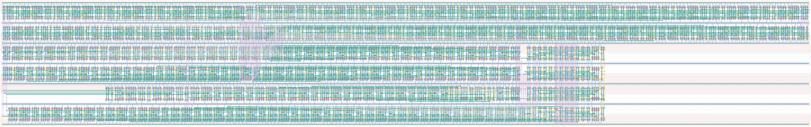

# `async_datapath_1` Module


## Cell Hierarchy

`async_datapath_1` **1726** (number MOS pairs)
- `async_counter_equal_16` **359**
- `async_counter_32` **480**
- `nand2` **2**
- `inv` **1**
- `shift_reg_32` **704**
- `mux2` **7**
- `synchronizer` **34**
- `async_counter_8` **120**
- `equal_to_32` **17**
- `buffer` **2**

## Netlist

```
.SUBCKT async_datapath_1 clk clk_en clk_ready conf_tdccnt<0> conf_tdccnt<1> conf_tdccnt<2>
                         + conf_tdccnt<3> conf_tdccnt<4> conf_tdccnt<5> conf_tdccnt<6>
                         + conf_tdccnt<7> conf_tdccnt<8> conf_tdccnt<9> conf_tdccnt<10>
                         + conf_tdccnt<11> conf_tdccnt<12> conf_tdccnt<13> conf_tdccnt<14>
                         + conf_tdccnt<15> data_out data_ready rst rst' ser_clk ser_ready tdc_ready
                         + vdd vss
    Xi0 tdc_ready conf_tdccnt<0> conf_tdccnt<1> conf_tdccnt<2> conf_tdccnt<3> conf_tdccnt<4>
        + conf_tdccnt<5> conf_tdccnt<6> conf_tdccnt<7> conf_tdccnt<8> conf_tdccnt<9> conf_tdccnt<10>
        + conf_tdccnt<11> conf_tdccnt<12> conf_tdccnt<13> conf_tdccnt<14> conf_tdccnt<15> clk_ready
        + rst rst' vdd vss async_counter_equal_16
    Xi1 net04 clk_cnt<0> clk_cnt<1> clk_cnt<2> clk_cnt<3> clk_cnt<4> clk_cnt<5> clk_cnt<6>
        + clk_cnt<7> clk_cnt<8> clk_cnt<9> clk_cnt<10> clk_cnt<11> clk_cnt<12> clk_cnt<13>
        + clk_cnt<14> clk_cnt<15> clk_cnt<16> clk_cnt<17> clk_cnt<18> clk_cnt<19> clk_cnt<20>
        + clk_cnt<21> clk_cnt<22> clk_cnt<23> clk_cnt<24> clk_cnt<25> clk_cnt<26> clk_cnt<27>
        + clk_cnt<28> clk_cnt<29> clk_cnt<30> clk_cnt<31> net09 rst rst' vdd vss async_counter_32
    Xi2 clk clk_en net05 vdd vss nand2
    Xi3 net05 net04 vdd vss inv
    Xi4 shift_clk clk_cnt<0> clk_cnt<1> clk_cnt<2> clk_cnt<3> clk_cnt<4> clk_cnt<5> clk_cnt<6>
        + clk_cnt<7> clk_cnt<8> clk_cnt<9> clk_cnt<10> clk_cnt<11> clk_cnt<12> clk_cnt<13>
        + clk_cnt<14> clk_cnt<15> clk_cnt<16> clk_cnt<17> clk_cnt<18> clk_cnt<19> clk_cnt<20>
        + clk_cnt<21> clk_cnt<22> clk_cnt<23> clk_cnt<24> clk_cnt<25> clk_cnt<26> clk_cnt<27>
        + clk_cnt<28> clk_cnt<29> clk_cnt<30> clk_cnt<31> clk_cnt<0> data_out rst rst' data_ready
        + vdd vss shift_reg_32
    Xi5 clk ser_clk net021 data_ready vdd vss mux2
    Xi6 clk ser_clk net027 rst rst' vdd vss synchronizer
    Xi7 net027 ser_cnt<0> ser_cnt<1> ser_cnt<2> ser_cnt<3> ser_cnt<4> ser_cnt<5> ser_cnt<6>
        + ser_cnt<7> net025 rst rst' vdd vss async_counter_8
    Xi8 ser_ready ser_cnt<0> ser_cnt<1> ser_cnt<2> ser_cnt<3> ser_cnt<4> ser_cnt<5> ser_cnt<6>
        + ser_cnt<7> vdd vss equal_to_32
    Xi9 net021 shift_clk vdd vss buffer
.ENDS
```
