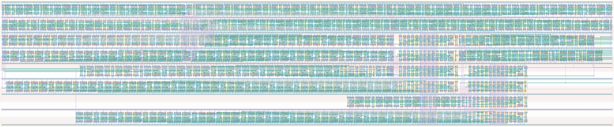

# `async_top_level` Module


## Cell Hierarchy

`async_top_level` **2295** (number MOS pairs)
- `async_control_0` **47**
- `async_control_1` **74**
- `async_datapath_0` **430**
- `async_datapath_1` **1726**
- `nand2` **2** *x2*
- `nor2` **2** *x2*
- `buffer` **2** *x4*
- `inv` **1** *x2*

## Netlist

```
.SUBCKT async_top_level clk clk_en clk_ready conf_statecnt<0> conf_statecnt<1> conf_statecnt<2>
                        + conf_statecnt<3> conf_statecnt<4> conf_statecnt<5> conf_statecnt<6>
                        + conf_statecnt<7> conf_statecnt<8> conf_statecnt<9> conf_statecnt<10>
                        + conf_statecnt<11> conf_statecnt<12> conf_statecnt<13> conf_statecnt<14>
                        + conf_statecnt<15> conf_tdccnt<0> conf_tdccnt<1> conf_tdccnt<2>
                        + conf_tdccnt<3> conf_tdccnt<4> conf_tdccnt<5> conf_tdccnt<6> conf_tdccnt<7>
                        + conf_tdccnt<8> conf_tdccnt<9> conf_tdccnt<10> conf_tdccnt<11>
                        + conf_tdccnt<12> conf_tdccnt<13> conf_tdccnt<14> conf_tdccnt<15> data_out
                        + data_ready dp0_rst dp0_rst' dp1_rst mero_e2l mero_en rst rst' ser_clk
                        + ser_ready state0<0> state0<1> state1<0> state1<1> state1<2> sta_ready
                        + tdc0_ready tdc1_ready tdc_ready vdd vss
    Xi0 clk mero_e2l mero_en rst rst' state0<0> state0<1> sta_ready tdc_ready ctrl0_rst vdd vss
        + async_control_0
    Xi1 clk clk_en clk_ready ctrl1_rst data_ready rst rst' ser_ready state1<0> state1<1> state1<2>
        + vdd vss async_control_1
    Xi2 clk conf_statecnt<0> conf_statecnt<1> conf_statecnt<2> conf_statecnt<3> conf_statecnt<4>
        + conf_statecnt<5> conf_statecnt<6> conf_statecnt<7> conf_statecnt<8> conf_statecnt<9>
        + conf_statecnt<10> conf_statecnt<11> conf_statecnt<12> conf_statecnt<13> conf_statecnt<14>
        + conf_statecnt<15> dp0_rst dp0_rst' sta_ready tdc0_ready tdc1_ready tdc_ready vdd vss
        + async_datapath_0
    Xi3 clk clk_en clk_ready conf_tdccnt<0> conf_tdccnt<1> conf_tdccnt<2> conf_tdccnt<3>
        + conf_tdccnt<4> conf_tdccnt<5> conf_tdccnt<6> conf_tdccnt<7> conf_tdccnt<8> conf_tdccnt<9>
        + conf_tdccnt<10> conf_tdccnt<11> conf_tdccnt<12> conf_tdccnt<13> conf_tdccnt<14>
        + conf_tdccnt<15> data_out data_ready dp1_rst dp1_rst' ser_clk ser_ready tdc_ready vdd vss
        + async_datapath_1
    Xi5 ctrl1_rst' rst' dp1_rst_i vdd vss nand2
    Xi4 ctrl0_rst' rst' dp0_rst_i vdd vss nand2
    Xi7 ctrl1_rst rst dp1_rst'_i vdd vss nor2
    Xi6 ctrl0_rst rst dp0_rst'_i vdd vss nor2
    Xi11 dp1_rst'_i dp1_rst' vdd vss buffer
    Xi10 dp1_rst_i dp1_rst vdd vss buffer
    Xi9 dp0_rst'_i dp0_rst' vdd vss buffer
    Xi8 dp0_rst_i dp0_rst vdd vss buffer
    Xi13 ctrl1_rst ctrl1_rst' vdd vss inv
    Xi12 ctrl0_rst ctrl0_rst' vdd vss inv
.ENDS
```
