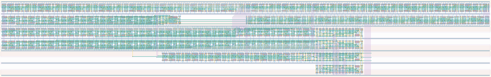

# `bit_datapath` Module


## Cell Hierarchy

`bit_datapath` **1375** (number MOS pairs)
- `async_counter_16` **240** *x2*
- `synchronizer` **34** *x3*
- `async_counter_8` **120**
- `equal_to_24` **16**
- `shift_reg_24` **528**
- `nand2` **2**
- `inv` **1**
- `mux2` **7**
- `check_equal_16` **119**

## Netlist

```
.SUBCKT bit_datapath clk conf_statecnt<0> conf_statecnt<1> conf_statecnt<2> conf_statecnt<3>
                     + conf_statecnt<4> conf_statecnt<5> conf_statecnt<6> conf_statecnt<7>
                     + conf_statecnt<8> conf_statecnt<9> conf_statecnt<10> conf_statecnt<11>
                     + conf_statecnt<12> conf_statecnt<13> conf_statecnt<14> conf_statecnt<15>
                     + data_out data_ready dc_int rst rst' send_data<0> send_data<1> send_data<2>
                     + send_data<3> send_data<4> send_data<5> send_data<6> send_data<7> ser_clk
                     + ser_ready sta_ready tdc0_ready tdc1_ready tdc_ready vdd vss
    Xi10 clk sta_cnt<0> sta_cnt<1> sta_cnt<2> sta_cnt<3> sta_cnt<4> sta_cnt<5> sta_cnt<6> sta_cnt<7>
         + sta_cnt<8> sta_cnt<9> sta_cnt<10> sta_cnt<11> sta_cnt<12> sta_cnt<13> sta_cnt<14>
         + sta_cnt<15> net030 rst rst' vdd vss async_counter_16
    Xi0 dc_int send_data<8> send_data<9> send_data<10> send_data<11> send_data<12> send_data<13>
        + send_data<14> send_data<15> send_data<16> send_data<17> send_data<18> send_data<19>
        + send_data<20> send_data<21> send_data<22> send_data<23> net7 rst rst' vdd vss
        + async_counter_16
    Xi6 clk tdc1_ready tdc1_ready_s rst rst' vdd vss synchronizer
    Xi5 clk tdc0_ready tdc0_ready_s rst rst' vdd vss synchronizer
    Xi1 clk ser_clk net10 rst rst' vdd vss synchronizer
    Xi2 net10 ser_cnt<0> ser_cnt<1> ser_cnt<2> ser_cnt<3> ser_cnt<4> ser_cnt<5> ser_cnt<6>
        + ser_cnt<7> net15 rst rst' vdd vss async_counter_8
    Xi3 ser_ready ser_cnt<0> ser_cnt<1> ser_cnt<2> ser_cnt<3> ser_cnt<4> ser_cnt<5> ser_cnt<6>
        + ser_cnt<7> vdd vss equal_to_24
    Xi4 shift_clk send_data<0> send_data<1> send_data<2> send_data<3> send_data<4> send_data<5>
        + send_data<6> send_data<7> send_data<8> send_data<9> send_data<10> send_data<11>
        + send_data<12> send_data<13> send_data<14> send_data<15> send_data<16> send_data<17>
        + send_data<18> send_data<19> send_data<20> send_data<21> send_data<22> send_data<23>
        + send_data<0> data_out rst rst' data_ready vdd vss shift_reg_24
    Xi7 tdc0_ready_s tdc1_ready_s net038 vdd vss nand2
    Xi8 net038 tdc_ready vdd vss inv
    Xi9 clk ser_clk shift_clk data_ready vdd vss mux2
    Xi11 sta_ready sta_cnt<0> sta_cnt<1> sta_cnt<2> sta_cnt<3> sta_cnt<4> sta_cnt<5> sta_cnt<6>
         + sta_cnt<7> sta_cnt<8> sta_cnt<9> sta_cnt<10> sta_cnt<11> sta_cnt<12> sta_cnt<13>
         + sta_cnt<14> sta_cnt<15> conf_statecnt<0> conf_statecnt<1> conf_statecnt<2>
         + conf_statecnt<3> conf_statecnt<4> conf_statecnt<5> conf_statecnt<6> conf_statecnt<7>
         + conf_statecnt<8> conf_statecnt<9> conf_statecnt<10> conf_statecnt<11> conf_statecnt<12>
         + conf_statecnt<13> conf_statecnt<14> conf_statecnt<15> vdd vss check_equal_16
.ENDS
```
