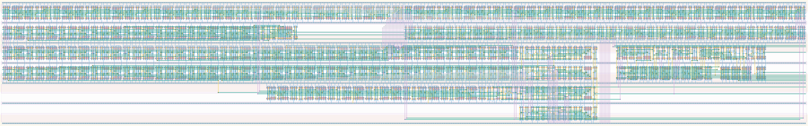

# `bit_top_level` Module


## Cell Hierarchy

`bit_top_level` **1485** (number MOS pairs)
- `bit_datapath` **1375**
- `conf_control` **101**
- `inv` **1**
- `nand2` **2**
- `nor2` **2**
- `buffer` **2** *x2*

## Netlist

```
.SUBCKT bit_top_level alarm_dc clk conf_statecnt<0> conf_statecnt<1> conf_statecnt<2>
                      + conf_statecnt<3> conf_statecnt<4> conf_statecnt<5> conf_statecnt<6>
                      + conf_statecnt<7> conf_statecnt<8> conf_statecnt<9> conf_statecnt<10>
                      + conf_statecnt<11> conf_statecnt<12> conf_statecnt<13> conf_statecnt<14>
                      + conf_statecnt<15> data_out data_ready dat_rst dat_rst' dc_int e2l_en mero_en
                      + rand0 rand1 rst rst' send_free ser_clk ser_ready state<0> state<1> state<2>
                      + sta_ready tdc0_alarm<0> tdc0_alarm<1> tdc0_ready tdc1_alarm<0> tdc1_alarm<1>
                      + tdc1_ready tdc_ready vdd vss
    Xi0 clk conf_statecnt<0> conf_statecnt<1> conf_statecnt<2> conf_statecnt<3> conf_statecnt<4>
        + conf_statecnt<5> conf_statecnt<6> conf_statecnt<7> conf_statecnt<8> conf_statecnt<9>
        + conf_statecnt<10> conf_statecnt<11> conf_statecnt<12> conf_statecnt<13> conf_statecnt<14>
        + conf_statecnt<15> data_out data_ready dc_int dat_rst dat_rst' tdc0_alarm<0> tdc0_alarm<1>
        + tdc1_alarm<0> tdc1_alarm<1> alarm_dc rand0 rand1 send_free ser_clk ser_ready sta_ready
        + tdc0_ready tdc1_ready tdc_ready vdd vss bit_datapath
    Xi1 e2l_en mero_en clk ctrl_rst data_ready rst rst' ser_ready state<0> state<1> state<2>
        + sta_ready tdc_ready vdd vss conf_control
    Xi2 ctrl_rst ctrl_rst' vdd vss inv
    Xi3 ctrl_rst' rst' dat_rst_i vdd vss nand2
    Xi4 ctrl_rst rst dat_rst_i' vdd vss nor2
    Xi6 dat_rst_i' dat_rst' vdd vss buffer
    Xi5 dat_rst_i dat_rst vdd vss buffer
.ENDS
```
