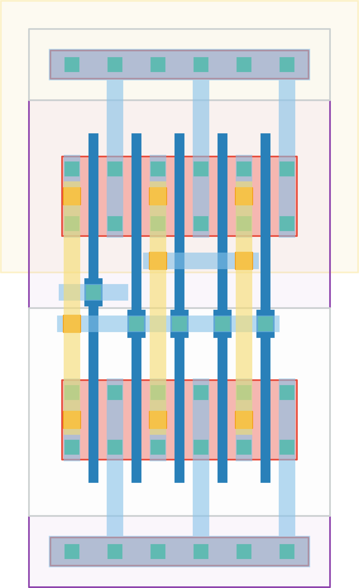

# `buffer` Module


## Cell Hierarchy

`buffer` **2** (number MOS pairs)
- `n_mos` **0** *x2*
- `p_mos` **0** *x2*

## Netlist

```
.SUBCKT buffer in out vdd vss
    Mm1 out int vss vss n_mos l=60n w=480.0n m=4
    Mm0 int in vss vss n_mos l=60n w=480.0n m=1
    Mm3 out int vdd vdd p_mos l=60n w=480.0n m=4
    Mm2 int in vdd vdd p_mos l=60n w=480.0n m=1
.ENDS
```
