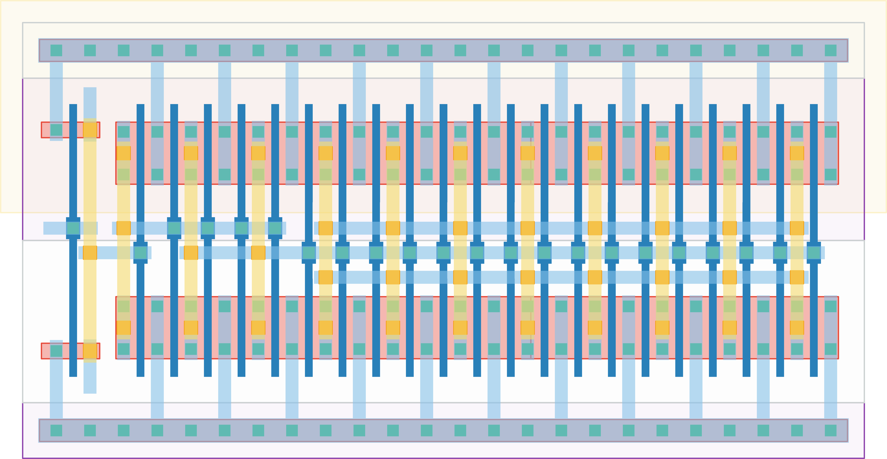

# `buffer_large` Module


## Cell Hierarchy

`buffer_large` **4** (number MOS pairs)
- `n_mos` **0** *x4*
- `p_mos` **0** *x4*

## Netlist

```
.SUBCKT buffer_large IN OUT VDD VSS
    Mm7 OUT INT<2> VSS VSS n_mos l=60n w=480.0n m=16
    Mm5 INT<2> INT<1> VSS VSS n_mos l=60n w=480.0n m=4
    Mm2 INT<1> INT<0> VSS VSS n_mos l=60n w=480.0n m=1
    Mm0 INT<0> IN VSS VSS n_mos l=60n w=120.0n m=1
    Mm6 OUT INT<2> VDD VDD p_mos l=60n w=480.0n m=16
    Mm4 INT<2> INT<1> VDD VDD p_mos l=60n w=480.0n m=4
    Mm3 INT<1> INT<0> VDD VDD p_mos l=60n w=480.0n m=1
    Mm1 INT<0> IN VDD VDD p_mos l=60n w=120.0n m=1
.ENDS
```
