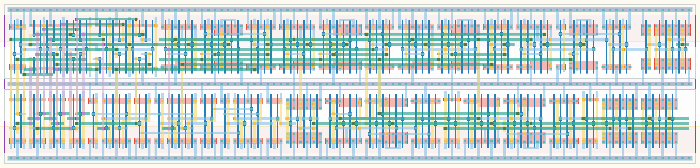

# `cal_tdc` Module


## Cell Hierarchy

`cal_tdc` **151** (number MOS pairs)
- `ro_2i` **20**
- `freqscaler3` **45**
- `inv_sd` **1**
- `mux4` **21**
- `inv_bank_8` **8**
- `dff_st_ar_dh` **14**
- `dff_st_ar_buf` **17** *x2*
- `buffer` **2** *x4*

## Netlist

```
.SUBCKT cal_tdc cal_enable conf<0> conf<1> conf<2> conf<3> conf<4> conf<5> conf<6> conf<7> out0 out1
                + out2 ro_enable ro_out rst rst' sel<0> sel<1> vdd vss
    Xi0 net6<0> net6<1> net6<2> net6<3> net6<4> net6<5> net6<6> net6<7> conf<0> conf<1> conf<2>
        + conf<3> conf<4> conf<5> conf<6> conf<7> ro_enable ro<0> vdd vss ro_2i
    Xi1 ro<0> ro<1> ro<2> ro<3> rst rst' vdd vss freqscaler3
    Xi8 net023 out0_i vdd vss inv_sd
    Xi4 ro<0> ro<1> ro<2> ro<3> mux_out sel<0> sel<1> vdd vss mux4
    Xi5 conf<0> conf<1> conf<2> conf<3> conf<4> conf<5> conf<6> conf<7> net6<0> net6<1> net6<2>
        + net6<3> net6<4> net6<5> net6<6> net6<7> vdd vss inv_bank_8
    Xi7 cal_enable net027 net023 rst rst' vdd vss dff_st_ar_dh
    Xi3 ro_out out1_i out2_i net11 rst rst' vdd vss dff_st_ar_buf
    Xi2 ro_out cal_enable out1_i net17 rst rst' vdd vss dff_st_ar_buf
    Xi12 out2_i out2 vdd vss buffer
    Xi11 out1_i out1 vdd vss buffer
    Xi10 out0_i out0 vdd vss buffer
    Xi9 mux_out ro_out vdd vss buffer
.ENDS
```
