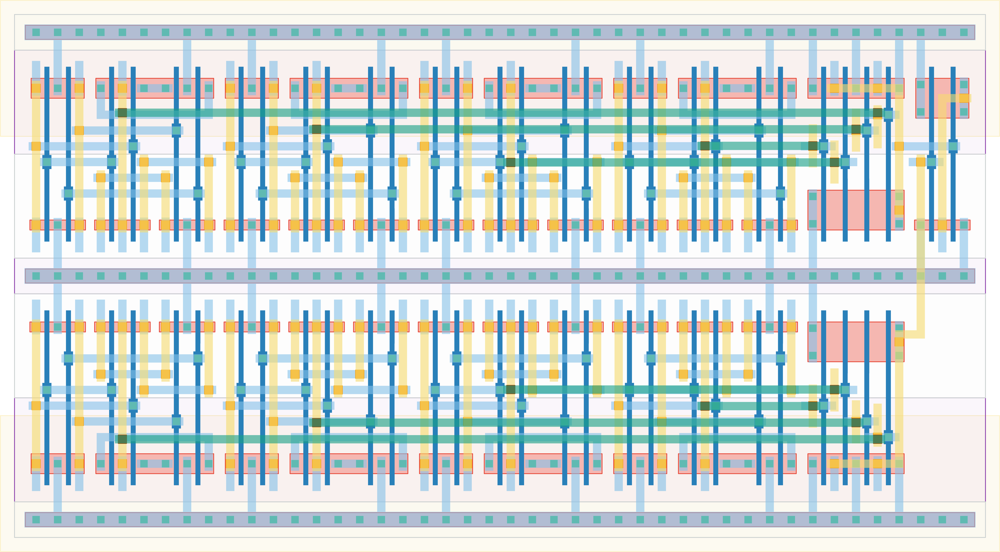

# `check_equal_8` Module


## Cell Hierarchy

`check_equal_8` **58** (number MOS pairs)
- `xnor2` **6** *x8*
- `nand4` **4** *x2*
- `nor2` **2**

## Netlist

```
.SUBCKT check_equal_8 equal in0<0> in0<1> in0<2> in0<3> in0<4> in0<5> in0<6> in0<7> in1<0> in1<1>
                      + in1<2> in1<3> in1<4> in1<5> in1<6> in1<7> vdd vss
    Xi9 in0<4> in1<4> xnor<4> vdd vss xnor2
    Xi7 in0<7> in1<7> xnor<7> vdd vss xnor2
    Xi6 in0<6> in1<6> xnor<6> vdd vss xnor2
    Xi5 in0<5> in1<5> xnor<5> vdd vss xnor2
    Xi3 in0<3> in1<3> xnor<3> vdd vss xnor2
    Xi2 in0<2> in1<2> xnor<2> vdd vss xnor2
    Xi1 in0<1> in1<1> xnor<1> vdd vss xnor2
    Xi0 in0<0> in1<0> xnor<0> vdd vss xnor2
    Xi8 xnor<4> xnor<5> xnor<6> xnor<7> nand1 vdd vss nand4
    Xi4 xnor<0> xnor<1> xnor<2> xnor<3> nand0 vdd vss nand4
    Xi10 nand0 nand1 equal vdd vss nor2
.ENDS
```
