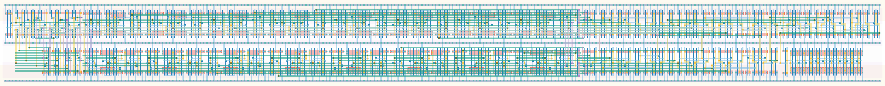

# `clk_manager` Module


## Cell Hierarchy

`clk_manager` **377** (number MOS pairs)
- `ro_2i` **20**
- `freq_scaler16` **240**
- `mux16` **105**
- `buffer_large` **4**
- `inv_bank_8` **8**

## Netlist

```
.SUBCKT clk_manager CLK CONF_CLK<0> CONF_CLK<1> CONF_CLK<2> CONF_CLK<3> CONF_CLK<4> CONF_CLK<5>
                    + CONF_CLK<6> CONF_CLK<7> CONF_CLK<8> CONF_CLK<9> CONF_CLK<10> CONF_CLK<11>
                    + ENABLE RST RST' VDD VSS
    Xi0 CONF_CLK'<0> CONF_CLK'<1> CONF_CLK'<2> CONF_CLK'<3> CONF_CLK'<4> CONF_CLK'<5> CONF_CLK'<6>
        + CONF_CLK'<7> CONF_CLK<0> CONF_CLK<1> CONF_CLK<2> CONF_CLK<3> CONF_CLK<4> CONF_CLK<5>
        + CONF_CLK<6> CONF_CLK<7> ENABLE MUX_IN<15> VDD VSS ro_2i
    Xi1 MUX_IN<15> MUX_IN<0> MUX_IN<1> MUX_IN<2> MUX_IN<3> MUX_IN<4> MUX_IN<5> MUX_IN<6> MUX_IN<7>
        + MUX_IN<8> MUX_IN<9> MUX_IN<10> MUX_IN<11> MUX_IN<12> MUX_IN<13> MUX_IN<14> net010 net11
        + RST RST' VDD VSS freq_scaler16
    Xi3 MUX_IN<0> MUX_IN<1> MUX_IN<2> MUX_IN<3> MUX_IN<4> MUX_IN<5> MUX_IN<6> MUX_IN<7> MUX_IN<8>
        + MUX_IN<9> MUX_IN<10> MUX_IN<11> MUX_IN<12> MUX_IN<13> MUX_IN<14> MUX_IN<15> net17
        + CONF_CLK<8> CONF_CLK<9> CONF_CLK<10> CONF_CLK<11> VDD VSS mux16
    Xi2 net17 CLK VDD VSS buffer_large
    Xi4 CONF_CLK<0> CONF_CLK<1> CONF_CLK<2> CONF_CLK<3> CONF_CLK<4> CONF_CLK<5> CONF_CLK<6>
        + CONF_CLK<7> CONF_CLK'<0> CONF_CLK'<1> CONF_CLK'<2> CONF_CLK'<3> CONF_CLK'<4> CONF_CLK'<5>
        + CONF_CLK'<6> CONF_CLK'<7> VDD VSS inv_bank_8
.ENDS
```
