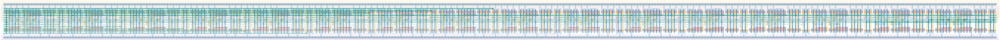

# `conf_16` Module


## Cell Hierarchy

`conf_16` **272** (number MOS pairs)
- `conf_8` **136** *x2*

## Netlist

```
.SUBCKT conf_16 clk in out<0> out<1> out<2> out<3> out<4> out<5> out<6> out<7> out<8> out<9> out<10>
                + out<11> out<12> out<13> out<14> out<15> rst rst' vdd vss
    Xi1 clk out<7> out<8> out<9> out<10> out<11> out<12> out<13> out<14> out<15> rst rst' vdd vss
        + conf_8
    Xi0 clk in out<0> out<1> out<2> out<3> out<4> out<5> out<6> out<7> rst rst' vdd vss conf_8
.ENDS
```
