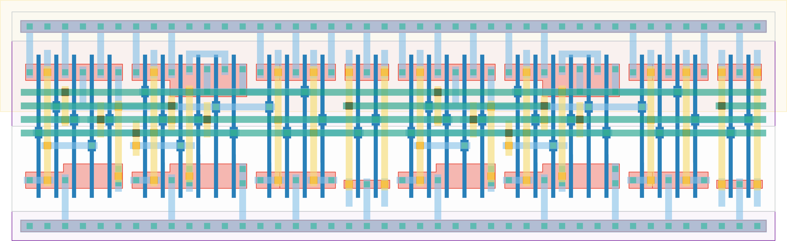

# `conf_2` Module


## Cell Hierarchy

`conf_2` **34** (number MOS pairs)
- `dff_st_ar_buf` **17** *x2*

## Netlist

```
.SUBCKT conf_2 clk in out<0> out<1> rst rst' vdd vss
    Xi1 clk out<0> out<1> net14 rst rst' vdd vss dff_st_ar_buf
    Xi0 clk in out<0> net13 rst rst' vdd vss dff_st_ar_buf
.ENDS
```
