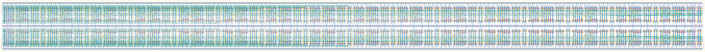

# `conf_32` Module


## Cell Hierarchy

`conf_32` **544** (number MOS pairs)
- `conf_16` **272** *x2*

## Netlist

```
.SUBCKT conf_32 clk in out<0> out<1> out<2> out<3> out<4> out<5> out<6> out<7> out<8> out<9> out<10>
                + out<11> out<12> out<13> out<14> out<15> out<16> out<17> out<18> out<19> out<20>
                + out<21> out<22> out<23> out<24> out<25> out<26> out<27> out<28> out<29> out<30>
                + out<31> rst rst' vdd vss
    Xi1 clk out<15> out<16> out<17> out<18> out<19> out<20> out<21> out<22> out<23> out<24> out<25>
        + out<26> out<27> out<28> out<29> out<30> out<31> rst rst' vdd vss conf_16
    Xi0 clk in out<0> out<1> out<2> out<3> out<4> out<5> out<6> out<7> out<8> out<9> out<10> out<11>
        + out<12> out<13> out<14> out<15> rst rst' vdd vss conf_16
.ENDS
```
