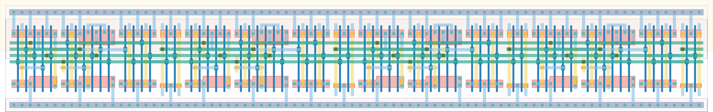

# `conf_4` Module


## Cell Hierarchy

`conf_4` **68** (number MOS pairs)
- `conf_2` **34** *x2*

## Netlist

```
.SUBCKT conf_4 clk in out<0> out<1> out<2> out<3> rst rst' vdd vss
    Xi1 clk out<1> out<2> out<3> rst rst' vdd vss conf_2
    Xi0 clk in out<0> out<1> rst rst' vdd vss conf_2
.ENDS
```
