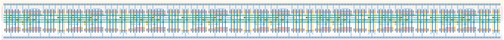

# `conf_8` Module


## Cell Hierarchy

`conf_8` **136** (number MOS pairs)
- `conf_4` **68** *x2*

## Netlist

```
.SUBCKT conf_8 clk in out<0> out<1> out<2> out<3> out<4> out<5> out<6> out<7> rst rst' vdd vss
    Xi1 clk out<3> out<4> out<5> out<6> out<7> rst rst' vdd vss conf_4
    Xi0 clk in out<0> out<1> out<2> out<3> rst rst' vdd vss conf_4
.ENDS
```
