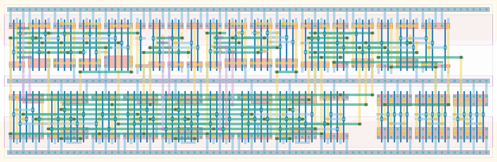

# `conf_control` Module


## Cell Hierarchy

`conf_control` **101** (number MOS pairs)
- `dff_st_ar` **15** *x3*
- `nand4` **4**
- `nand3` **3** *x8*
- `inv` **1** *x4*
- `nand2` **2** *x9*
- `buffer` **2** *x3*

## Netlist

```
.SUBCKT conf_control cal_en cal_ro_en clk ctrl_rst data_ready rst rst' ser_ready state<0> state<1>
                     + state<2> sta_ready tdc_ready vdd vss
    Xi2 clk nextstate<2> state<2> state'<2> rst rst' vdd vss dff_st_ar
    Xi1 clk nextstate<1> state<1> state'<1> rst rst' vdd vss dff_st_ar
    Xi0 clk nextstate<0> state<0> state'<0> rst rst' vdd vss dff_st_ar
    Xi14 state0_int<0> state0_int<1> state0_int<2> state0_int<3> nextstate<0> vdd vss nand4
    Xi30 state'<0> state<1> state<2> net037 vdd vss nand3
    Xi28 state<0> state'<1> state<2> net038 vdd vss nand3
    Xi42 state'<0> state<1> state<2> state2_int<2> vdd vss nand3
    Xi23 state'<0> state<1> sta_ready state2_int<1> vdd vss nand3
    Xi43 state2_int<0> state2_int<1> state2_int<2> nextstate<2> vdd vss nand3
    Xi11 state<0> state<2> ser_ready' state0_int<1> vdd vss nand3
    Xi12 state<0> state<1> state<2> state0_int<2> vdd vss nand3
    Xi38 state<1> state<2> tdc_ready state0_int<3> vdd vss nand3
    Xi33 net044 cal_ro_en_i vdd vss inv
    Xi31 net037 cal_en_i vdd vss inv
    Xi29 net038 data_ready_i vdd vss inv
    Xi45 ser_ready ser_ready' vdd vss inv
    Xi32 state'<0> state<1> net044 vdd vss nand2
    Xi34 ctrl_rst_int<0> ctrl_rst_int<1> ctrl_rst vdd vss nand2
    Xi36 state'<1> state'<2> ctrl_rst_int<0> vdd vss nand2
    Xi22 state<0> state<2> state2_int<0> vdd vss nand2
    Xi41 state1_int<0> state1_int<1> nextstate<1> vdd vss nand2
    Xi40 state<0> state'<2> state1_int<1> vdd vss nand2
    Xi39 state'<0> state<1> state1_int<0> vdd vss nand2
    Xi10 state'<1> state'<2> state0_int<0> vdd vss nand2
    Xi44 state<0> state'<2> ctrl_rst_int<1> vdd vss nand2
    Xi48 data_ready_i data_ready vdd vss buffer
    Xi49 cal_en_i cal_en vdd vss buffer
    Xi46 cal_ro_en_i cal_ro_en vdd vss buffer
.ENDS
```
