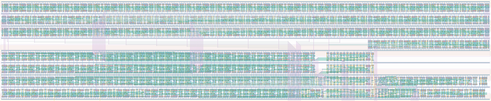

# `conf_datapath` Module


## Cell Hierarchy

`conf_datapath` **2381** (number MOS pairs)
- `async_counter_16` **240** *x3*
- `cal_tdc` **151**
- `async_counter_8` **120**
- `synchronizer` **34** *x3*
- `equal_to_52` **15**
- `check_equal_16` **119**
- `nand2` **2**
- `inv` **1**
- `shift_reg_52` **1144**
- `mux2` **7**

## Netlist

```
.SUBCKT conf_datapath cal_en cal_out0 cal_out1 cal_out2 cal_roout cal_ro_en clk conf_statecnt<0>
                      + conf_statecnt<1> conf_statecnt<2> conf_statecnt<3> conf_statecnt<4>
                      + conf_statecnt<5> conf_statecnt<6> conf_statecnt<7> conf_statecnt<8>
                      + conf_statecnt<9> conf_statecnt<10> conf_statecnt<11> conf_statecnt<12>
                      + conf_statecnt<13> conf_statecnt<14> conf_statecnt<15> conf_tdccal<0>
                      + conf_tdccal<1> conf_tdccal<2> conf_tdccal<3> conf_tdccal<4> conf_tdccal<5>
                      + conf_tdccal<6> conf_tdccal<7> conf_tdccal<8> conf_tdccal<9> data_out
                      + data_ready rst rst' send_data<32> send_data<33> send_data<34> send_data<35>
                      + send_data<36> send_data<37> send_data<38> send_data<39> send_data<40>
                      + send_data<41> send_data<42> send_data<43> send_data<44> send_data<45>
                      + send_data<46> send_data<47> send_data<48> send_data<49> send_data<50>
                      + send_data<51> ser_clk ser_ready sta_ready tdc0_int tdc0_ready tdc1_int
                      + tdc1_ready tdc_ready vdd vss
    Xi3 clk state_cnt<0> state_cnt<1> state_cnt<2> state_cnt<3> state_cnt<4> state_cnt<5>
        + state_cnt<6> state_cnt<7> state_cnt<8> state_cnt<9> state_cnt<10> state_cnt<11>
        + state_cnt<12> state_cnt<13> state_cnt<14> state_cnt<15> net010 rst rst' vdd vss
        + async_counter_16
    Xi1 tdc0_int send_data<0> send_data<1> send_data<2> send_data<3> send_data<4> send_data<5>
        + send_data<6> send_data<7> send_data<8> send_data<9> send_data<10> send_data<11>
        + send_data<12> send_data<13> send_data<14> send_data<15> net7 rst rst' vdd vss
        + async_counter_16
    Xi0 tdc1_int send_data<16> send_data<17> send_data<18> send_data<19> send_data<20> send_data<21>
        + send_data<22> send_data<23> send_data<24> send_data<25> send_data<26> send_data<27>
        + send_data<28> send_data<29> send_data<30> send_data<31> net10 rst rst' vdd vss
        + async_counter_16
    Xi2 cal_en conf_tdccal<0> conf_tdccal<1> conf_tdccal<2> conf_tdccal<3> conf_tdccal<4>
        + conf_tdccal<5> conf_tdccal<6> conf_tdccal<7> cal_out0 cal_out1 cal_out2 cal_ro_en
        + cal_roout rst rst' conf_tdccal<8> conf_tdccal<9> vdd vss cal_tdc
    Xi4 net03 ser_cnt<0> ser_cnt<1> ser_cnt<2> ser_cnt<3> ser_cnt<4> ser_cnt<5> ser_cnt<6>
        + ser_cnt<7> net028 rst rst' vdd vss async_counter_8
    Xi10 clk tdc0_ready tdc0_readysync rst rst' vdd vss synchronizer
    Xi9 clk tdc1_ready tdc1_readysync rst rst' vdd vss synchronizer
    Xi5 clk ser_clk net03 rst rst' vdd vss synchronizer
    Xi7 ser_ready ser_cnt<0> ser_cnt<1> ser_cnt<2> ser_cnt<3> ser_cnt<4> ser_cnt<5> ser_cnt<6>
        + ser_cnt<7> vdd vss equal_to_52
    Xi8 sta_ready state_cnt<0> state_cnt<1> state_cnt<2> state_cnt<3> state_cnt<4> state_cnt<5>
        + state_cnt<6> state_cnt<7> state_cnt<8> state_cnt<9> state_cnt<10> state_cnt<11>
        + state_cnt<12> state_cnt<13> state_cnt<14> state_cnt<15> conf_statecnt<0> conf_statecnt<1>
        + conf_statecnt<2> conf_statecnt<3> conf_statecnt<4> conf_statecnt<5> conf_statecnt<6>
        + conf_statecnt<7> conf_statecnt<8> conf_statecnt<9> conf_statecnt<10> conf_statecnt<11>
        + conf_statecnt<12> conf_statecnt<13> conf_statecnt<14> conf_statecnt<15> vdd vss
        + check_equal_16
    Xi11 tdc0_readysync tdc1_readysync net09 vdd vss nand2
    Xi12 net09 tdc_ready vdd vss inv
    Xi13 shift_clk send_data<0> send_data<1> send_data<2> send_data<3> send_data<4> send_data<5>
         + send_data<6> send_data<7> send_data<8> send_data<9> send_data<10> send_data<11>
         + send_data<12> send_data<13> send_data<14> send_data<15> send_data<16> send_data<17>
         + send_data<18> send_data<19> send_data<20> send_data<21> send_data<22> send_data<23>
         + send_data<24> send_data<25> send_data<26> send_data<27> send_data<28> send_data<29>
         + send_data<30> send_data<31> send_data<32> send_data<33> send_data<34> send_data<35>
         + send_data<36> send_data<37> send_data<38> send_data<39> send_data<40> send_data<41>
         + send_data<42> send_data<43> send_data<44> send_data<45> send_data<46> send_data<47>
         + send_data<48> send_data<49> send_data<50> send_data<51> send_data<0> data_out rst rst'
         + data_ready vdd vss shift_reg_52
    Xi14 clk ser_clk shift_clk data_ready vdd vss mux2
.ENDS
```
