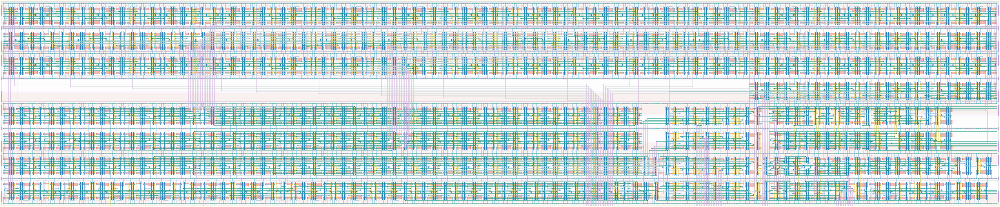

# `conf_top_level` Module


## Cell Hierarchy

`conf_top_level` **2491** (number MOS pairs)
- `conf_control` **101**
- `conf_datapath` **2381**
- `inv` **1**
- `nor2` **2**
- `nand2` **2**
- `buffer` **2** *x2*

## Netlist

```
.SUBCKT conf_top_level cal_en cal_out0 cal_out1 cal_out2 cal_roout cal_ro_en clk conf_statecnt<0>
                       + conf_statecnt<1> conf_statecnt<2> conf_statecnt<3> conf_statecnt<4>
                       + conf_statecnt<5> conf_statecnt<6> conf_statecnt<7> conf_statecnt<8>
                       + conf_statecnt<9> conf_statecnt<10> conf_statecnt<11> conf_statecnt<12>
                       + conf_statecnt<13> conf_statecnt<14> conf_statecnt<15> conf_tdccal<0>
                       + conf_tdccal<1> conf_tdccal<2> conf_tdccal<3> conf_tdccal<4> conf_tdccal<5>
                       + conf_tdccal<6> conf_tdccal<7> conf_tdccal<8> conf_tdccal<9> data_out
                       + data_ready dat_rst dat_rst' rst rst' ser_clk ser_ready state<0> state<1>
                       + state<2> sta_ready tdc0_alarm<0> tdc0_alarm<1> tdc0_ff<0> tdc0_ff<1>
                       + tdc0_ff<2> tdc0_ff<3> tdc0_ff<4> tdc0_ff<5> tdc0_ff<6> tdc0_ff<7> tdc0_int
                       + tdc0_ready tdc1_alarm<0> tdc1_alarm<1> tdc1_ff<0> tdc1_ff<1> tdc1_ff<2>
                       + tdc1_ff<3> tdc1_ff<4> tdc1_ff<5> tdc1_ff<6> tdc1_ff<7> tdc1_int tdc1_ready
                       + tdc_ready vdd vss
    Xi0 cal_en cal_ro_en clk ctrl_rst data_ready rst rst' ser_ready state<0> state<1> state<2>
        + sta_ready tdc_ready vdd vss conf_control
    Xi1 cal_en cal_out0 cal_out1 cal_out2 cal_roout cal_ro_en clk conf_statecnt<0> conf_statecnt<1>
        + conf_statecnt<2> conf_statecnt<3> conf_statecnt<4> conf_statecnt<5> conf_statecnt<6>
        + conf_statecnt<7> conf_statecnt<8> conf_statecnt<9> conf_statecnt<10> conf_statecnt<11>
        + conf_statecnt<12> conf_statecnt<13> conf_statecnt<14> conf_statecnt<15> conf_tdccal<0>
        + conf_tdccal<1> conf_tdccal<2> conf_tdccal<3> conf_tdccal<4> conf_tdccal<5> conf_tdccal<6>
        + conf_tdccal<7> conf_tdccal<8> conf_tdccal<9> data_out data_ready dat_rst dat_rst'
        + tdc0_ff<0> tdc0_ff<1> tdc0_ff<2> tdc0_ff<3> tdc0_ff<4> tdc0_ff<5> tdc0_ff<6> tdc0_ff<7>
        + tdc1_ff<0> tdc1_ff<1> tdc1_ff<2> tdc1_ff<3> tdc1_ff<4> tdc1_ff<5> tdc1_ff<6> tdc1_ff<7>
        + tdc0_alarm<0> tdc0_alarm<1> tdc1_alarm<0> tdc1_alarm<1> ser_clk ser_ready sta_ready
        + tdc0_int tdc0_ready tdc1_int tdc1_ready tdc_ready vdd vss conf_datapath
    Xi2 ctrl_rst ctrl_rst' vdd vss inv
    Xi3 ctrl_rst rst dat_rst_int' vdd vss nor2
    Xi4 ctrl_rst' rst' dat_rst_int vdd vss nand2
    Xi6 dat_rst_int dat_rst vdd vss buffer
    Xi5 dat_rst_int' dat_rst' vdd vss buffer
.ENDS
```
