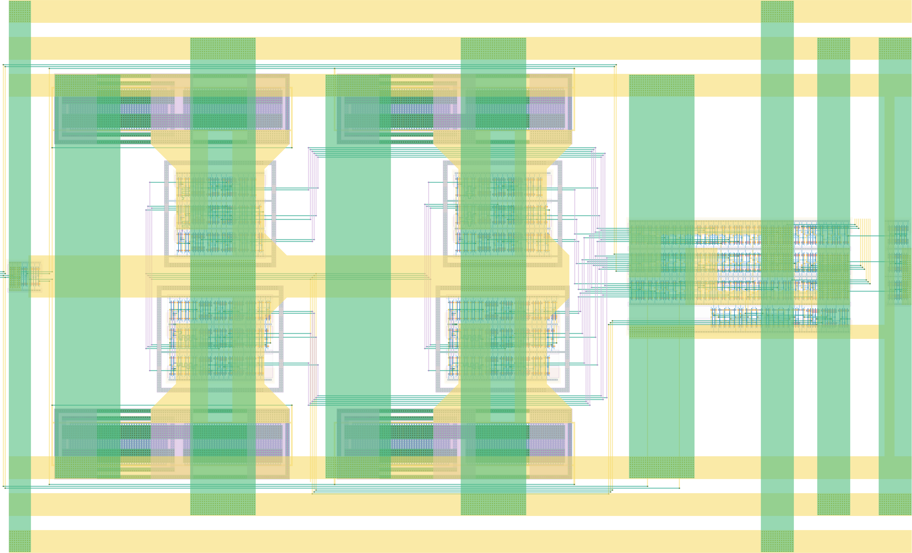

# `dc_collection` Module


## Cell Hierarchy

`dc_collection` **566** (number MOS pairs)
- `dc_3e_1b_no_config` **72**
- `dc_3e_4b_no_config` **90**
- `dc_3e_3b_no_config` **84**
- `single_ended_to_diff` **2** *x3*
- `mux4` **21** *x9*
- `dec4_inverted` **10**
- `dc_3e_2b_no_config` **78**
- `mero_collapse_3e` **37**
- `vdd_gate_1ma` **0** *x4*

## Netlist

```
.SUBCKT dc_collection alarm_dc conf_seldc<0> conf_seldc<1> dcedge0<1> dcedge0<2> dcedge0<3>
                      + dcedge1<1> dcedge1<2> dcedge1<3> dcedge2<1> dcedge2<2> dcedge2<3> edge0_n
                      + edge0_p edge1_n edge1_p edge2_n edge2_p enable_e2l enable_mero mero_int<0>
                      + mero_int<1> mero_int<2> rst rst' sel_dcedge<0> sel_dcedge<1> vdd_core vdd_dc
                      + vss
    Xi29 enable_e2l enable_mero mero_int0<0> mero_int1<0> mero_int2<0> mero_edge0<0> mero_edge1<0>
         + mero_edge2<0> rst rst' vdd_dc_int<0> vss dc_3e_1b_no_config
    Xi27 enable_e2l enable_mero mero_int0<3> mero_int1<3> mero_int2<3> mero_edge0<3> mero_edge1<3>
         + mero_edge2<3> rst rst' vdd_dc_int<3> vss dc_3e_4b_no_config
    Xi0 enable_e2l enable_mero mero_int0<2> mero_int1<2> mero_int2<2> mero_edge0<2> mero_edge1<2>
        + mero_edge2<2> rst rst' vdd_dc_int<2> vss dc_3e_3b_no_config
    Xi9 sedge0 edge0_n edge0_p vdd_dc vss single_ended_to_diff
    Xi11 sedge1 edge1_n edge1_p vdd_dc vss single_ended_to_diff
    Xi10 sedge2 edge2_n edge2_p vdd_dc vss single_ended_to_diff
    Xi21 mero_edge0<0> mero_edge0<1> mero_edge0<2> mero_edge0<3> dcedge0<0> conf_seldc<0>
         + conf_seldc<1> vdd_core vss mux4
    Xi19 mero_int0<0> mero_int0<1> mero_int0<2> mero_int0<3> mero_int<0> conf_seldc<0> conf_seldc<1>
         + vdd_core vss mux4
    Xi14 dcedge0<0> dcedge0<1> dcedge0<2> dcedge0<3> sedge0 sel_dcedge<0> sel_dcedge<1> vdd_core vss
         + mux4
    Xi22 mero_edge1<0> mero_edge1<1> mero_edge1<2> mero_edge1<3> dcedge1<0> conf_seldc<0>
         + conf_seldc<1> vdd_core vss mux4
    Xi18 mero_int1<0> mero_int1<1> mero_int1<2> mero_int1<3> mero_int<1> conf_seldc<0> conf_seldc<1>
         + vdd_core vss mux4
    Xi15 dcedge1<0> dcedge1<1> dcedge1<2> dcedge1<3> sedge1 sel_dcedge<0> sel_dcedge<1> vdd_core vss
         + mux4
    Xi20 mero_edge2<0> mero_edge2<1> mero_edge2<2> mero_edge2<3> dcedge2<0> conf_seldc<0>
         + conf_seldc<1> vdd_core vss mux4
    Xi17 mero_int2<0> mero_int2<1> mero_int2<2> mero_int2<3> mero_int<2> conf_seldc<0> conf_seldc<1>
         + vdd_core vss mux4
    Xi16 dcedge2<0> dcedge2<1> dcedge2<2> dcedge2<3> sedge2 sel_dcedge<0> sel_dcedge<1> vdd_core vss
         + mux4
    Xi30 seldc_dec<0> seldc_dec<1> seldc_dec<2> seldc_dec<3> conf_seldc<0> conf_seldc<1> vdd_core
         + vss dec4_inverted
    Xi24 enable_e2l enable_mero mero_int0<1> mero_int1<1> mero_int2<1> mero_edge0<1> mero_edge1<1>
         + mero_edge2<1> rst rst' vdd_dc_int<1> vss dc_3e_2b_no_config
    Xi3 alarm_dc enable_e2l mero_int<0> mero_int<1> mero_int<2> rst rst' vdd_dc vss mero_collapse_3e
    Xi28 seldc_dec<0> vdd_dc vdd_dc_int<0> vss vdd_gate_1ma
    Xi26 seldc_dec<3> vdd_dc vdd_dc_int<3> vss vdd_gate_1ma
    Xi25 seldc_dec<1> vdd_dc vdd_dc_int<1> vss vdd_gate_1ma
    Xi23 seldc_dec<2> vdd_dc vdd_dc_int<2> vss vdd_gate_1ma
.ENDS
```
