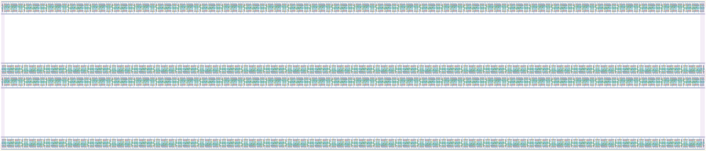

# `dc_jit_128` Module


## Cell Hierarchy

`dc_jit_128` **2048** (number MOS pairs)
- `dc_jit_64` **1024** *x2*

## Netlist

```
.SUBCKT dc_jit_128 CLK IN LAST OUT<0> OUT<1> OUT<2> OUT<3> OUT<4> OUT<5> OUT<6> OUT<7> OUT<8> OUT<9>
                   + OUT<10> OUT<11> OUT<12> OUT<13> OUT<14> OUT<15> OUT<16> OUT<17> OUT<18> OUT<19>
                   + OUT<20> OUT<21> OUT<22> OUT<23> OUT<24> OUT<25> OUT<26> OUT<27> OUT<28> OUT<29>
                   + OUT<30> OUT<31> OUT<32> OUT<33> OUT<34> OUT<35> OUT<36> OUT<37> OUT<38> OUT<39>
                   + OUT<40> OUT<41> OUT<42> OUT<43> OUT<44> OUT<45> OUT<46> OUT<47> OUT<48> OUT<49>
                   + OUT<50> OUT<51> OUT<52> OUT<53> OUT<54> OUT<55> OUT<56> OUT<57> OUT<58> OUT<59>
                   + OUT<60> OUT<61> OUT<62> OUT<63> OUT<64> OUT<65> OUT<66> OUT<67> OUT<68> OUT<69>
                   + OUT<70> OUT<71> OUT<72> OUT<73> OUT<74> OUT<75> OUT<76> OUT<77> OUT<78> OUT<79>
                   + OUT<80> OUT<81> OUT<82> OUT<83> OUT<84> OUT<85> OUT<86> OUT<87> OUT<88> OUT<89>
                   + OUT<90> OUT<91> OUT<92> OUT<93> OUT<94> OUT<95> OUT<96> OUT<97> OUT<98> OUT<99>
                   + OUT<100> OUT<101> OUT<102> OUT<103> OUT<104> OUT<105> OUT<106> OUT<107>
                   + OUT<108> OUT<109> OUT<110> OUT<111> OUT<112> OUT<113> OUT<114> OUT<115>
                   + OUT<116> OUT<117> OUT<118> OUT<119> OUT<120> OUT<121> OUT<122> OUT<123>
                   + OUT<124> OUT<125> OUT<126> OUT<127> RST RST' VDD VSS
    Xi1 CLK INT LAST OUT<64> OUT<65> OUT<66> OUT<67> OUT<68> OUT<69> OUT<70> OUT<71> OUT<72> OUT<73>
        + OUT<74> OUT<75> OUT<76> OUT<77> OUT<78> OUT<79> OUT<80> OUT<81> OUT<82> OUT<83> OUT<84>
        + OUT<85> OUT<86> OUT<87> OUT<88> OUT<89> OUT<90> OUT<91> OUT<92> OUT<93> OUT<94> OUT<95>
        + OUT<96> OUT<97> OUT<98> OUT<99> OUT<100> OUT<101> OUT<102> OUT<103> OUT<104> OUT<105>
        + OUT<106> OUT<107> OUT<108> OUT<109> OUT<110> OUT<111> OUT<112> OUT<113> OUT<114> OUT<115>
        + OUT<116> OUT<117> OUT<118> OUT<119> OUT<120> OUT<121> OUT<122> OUT<123> OUT<124> OUT<125>
        + OUT<126> OUT<127> RST RST' VDD VSS dc_jit_64
    Xi0 CLK IN INT OUT<0> OUT<1> OUT<2> OUT<3> OUT<4> OUT<5> OUT<6> OUT<7> OUT<8> OUT<9> OUT<10>
        + OUT<11> OUT<12> OUT<13> OUT<14> OUT<15> OUT<16> OUT<17> OUT<18> OUT<19> OUT<20> OUT<21>
        + OUT<22> OUT<23> OUT<24> OUT<25> OUT<26> OUT<27> OUT<28> OUT<29> OUT<30> OUT<31> OUT<32>
        + OUT<33> OUT<34> OUT<35> OUT<36> OUT<37> OUT<38> OUT<39> OUT<40> OUT<41> OUT<42> OUT<43>
        + OUT<44> OUT<45> OUT<46> OUT<47> OUT<48> OUT<49> OUT<50> OUT<51> OUT<52> OUT<53> OUT<54>
        + OUT<55> OUT<56> OUT<57> OUT<58> OUT<59> OUT<60> OUT<61> OUT<62> OUT<63> RST RST' VDD VSS
        + dc_jit_64
.ENDS
```
