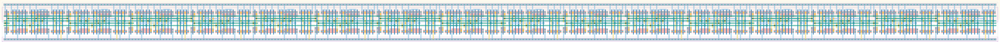

# `dc_jit_16` Module


## Cell Hierarchy

`dc_jit_16` **256** (number MOS pairs)
- `dc_jit_8` **128** *x2*

## Netlist

```
.SUBCKT dc_jit_16 clk in last out<0> out<1> out<2> out<3> out<4> out<5> out<6> out<7> out<8> out<9>
                  + out<10> out<11> out<12> out<13> out<14> out<15> rst rst' vdd vss
    Xi1 clk int last out<8> out<9> out<10> out<11> out<12> out<13> out<14> out<15> rst rst' vdd vss
        + dc_jit_8
    Xi0 clk in int out<0> out<1> out<2> out<3> out<4> out<5> out<6> out<7> rst rst' vdd vss dc_jit_8
.ENDS
```
