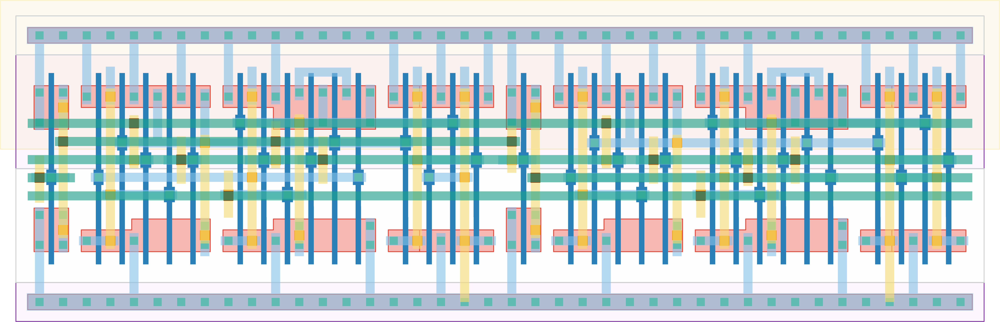

# `dc_jit_2` Module


## Cell Hierarchy

`dc_jit_2` **32** (number MOS pairs)
- `dff_st_ar` **15** *x2*
- `inv_jit` **1** *x2*

## Netlist

```
.SUBCKT dc_jit_2 CLK IN LAST OUT<0> OUT<1> RST RST' VDD VSS
    Xi3 CLK LAST OUT<1> net24 RST RST' VDD VSS dff_st_ar
    Xi2 CLK INT net25 OUT<0> RST RST' VDD VSS dff_st_ar
    Xi1 INT LAST VDD VSS inv_jit
    Xi0 IN INT VDD VSS inv_jit
.ENDS
```
