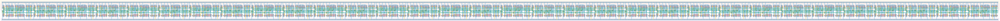

# `dc_jit_32` Module


## Cell Hierarchy

`dc_jit_32` **512** (number MOS pairs)
- `dc_jit_16` **256** *x2*

## Netlist

```
.SUBCKT dc_jit_32 CLK IN LAST OUT<0> OUT<1> OUT<2> OUT<3> OUT<4> OUT<5> OUT<6> OUT<7> OUT<8> OUT<9>
                  + OUT<10> OUT<11> OUT<12> OUT<13> OUT<14> OUT<15> OUT<16> OUT<17> OUT<18> OUT<19>
                  + OUT<20> OUT<21> OUT<22> OUT<23> OUT<24> OUT<25> OUT<26> OUT<27> OUT<28> OUT<29>
                  + OUT<30> OUT<31> RST RST' VDD VSS
    Xi1 CLK INT LAST OUT<16> OUT<17> OUT<18> OUT<19> OUT<20> OUT<21> OUT<22> OUT<23> OUT<24> OUT<25>
        + OUT<26> OUT<27> OUT<28> OUT<29> OUT<30> OUT<31> RST RST' VDD VSS dc_jit_16
    Xi0 CLK IN INT OUT<0> OUT<1> OUT<2> OUT<3> OUT<4> OUT<5> OUT<6> OUT<7> OUT<8> OUT<9> OUT<10>
        + OUT<11> OUT<12> OUT<13> OUT<14> OUT<15> RST RST' VDD VSS dc_jit_16
.ENDS
```
