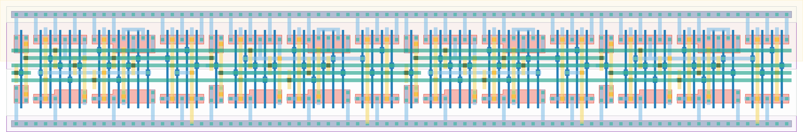

# `dc_jit_4` Module


## Cell Hierarchy

`dc_jit_4` **64** (number MOS pairs)
- `dc_jit_2` **32** *x2*

## Netlist

```
.SUBCKT dc_jit_4 clk in last out<0> out<1> out<2> out<3> rst rst' vdd vss
    Xi1 clk int last out<2> out<3> rst rst' vdd vss dc_jit_2
    Xi0 clk in int out<0> out<1> rst rst' vdd vss dc_jit_2
.ENDS
```
