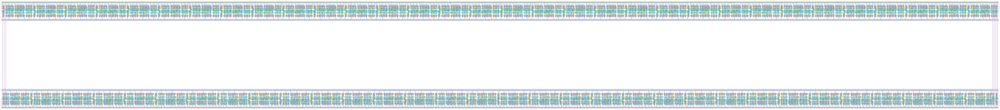

# `dc_jit_64` Module


## Cell Hierarchy

`dc_jit_64` **1024** (number MOS pairs)
- `dc_jit_32` **512** *x2*

## Netlist

```
.SUBCKT dc_jit_64 CLK IN LAST OUT<0> OUT<1> OUT<2> OUT<3> OUT<4> OUT<5> OUT<6> OUT<7> OUT<8> OUT<9>
                  + OUT<10> OUT<11> OUT<12> OUT<13> OUT<14> OUT<15> OUT<16> OUT<17> OUT<18> OUT<19>
                  + OUT<20> OUT<21> OUT<22> OUT<23> OUT<24> OUT<25> OUT<26> OUT<27> OUT<28> OUT<29>
                  + OUT<30> OUT<31> OUT<32> OUT<33> OUT<34> OUT<35> OUT<36> OUT<37> OUT<38> OUT<39>
                  + OUT<40> OUT<41> OUT<42> OUT<43> OUT<44> OUT<45> OUT<46> OUT<47> OUT<48> OUT<49>
                  + OUT<50> OUT<51> OUT<52> OUT<53> OUT<54> OUT<55> OUT<56> OUT<57> OUT<58> OUT<59>
                  + OUT<60> OUT<61> OUT<62> OUT<63> RST RST' VDD VSS
    Xi1 CLK INT LAST OUT<32> OUT<33> OUT<34> OUT<35> OUT<36> OUT<37> OUT<38> OUT<39> OUT<40> OUT<41>
        + OUT<42> OUT<43> OUT<44> OUT<45> OUT<46> OUT<47> OUT<48> OUT<49> OUT<50> OUT<51> OUT<52>
        + OUT<53> OUT<54> OUT<55> OUT<56> OUT<57> OUT<58> OUT<59> OUT<60> OUT<61> OUT<62> OUT<63>
        + RST RST' VDD VSS dc_jit_32
    Xi0 CLK IN INT OUT<0> OUT<1> OUT<2> OUT<3> OUT<4> OUT<5> OUT<6> OUT<7> OUT<8> OUT<9> OUT<10>
        + OUT<11> OUT<12> OUT<13> OUT<14> OUT<15> OUT<16> OUT<17> OUT<18> OUT<19> OUT<20> OUT<21>
        + OUT<22> OUT<23> OUT<24> OUT<25> OUT<26> OUT<27> OUT<28> OUT<29> OUT<30> OUT<31> RST RST'
        + VDD VSS dc_jit_32
.ENDS
```
