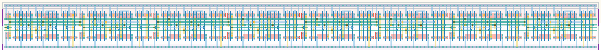

# `dc_jit_8` Module


## Cell Hierarchy

`dc_jit_8` **128** (number MOS pairs)
- `dc_jit_4` **64** *x2*

## Netlist

```
.SUBCKT dc_jit_8 clk in last out<0> out<1> out<2> out<3> out<4> out<5> out<6> out<7> rst rst' vdd
                 + vss
    Xi1 clk int last out<4> out<5> out<6> out<7> rst rst' vdd vss dc_jit_4
    Xi0 clk in int out<0> out<1> out<2> out<3> rst rst' vdd vss dc_jit_4
.ENDS
```
