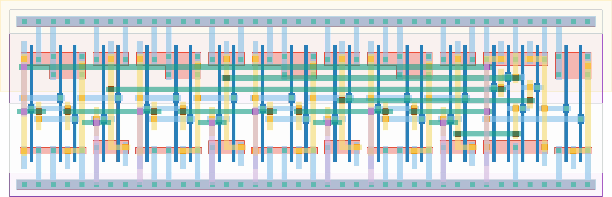

# `dec_4_conf_0` Module


## Cell Hierarchy

`dec_4_conf_0` **26** (number MOS pairs)
- `dec_stage` **5** *x4*
- `nor2` **2**
- `nand2` **2** *x2*

## Netlist

```
.SUBCKT dec_4_conf_0 conf_dec<0> conf_dec<1> conf_dec<2> conf_dec<3> ff_in<0> ff_in<1> ff_in<2>
                     + ff_in<3> rand_out vdd vss
    Xi27 conf_dec<3> ff_in<3> ff_in<2> stage<3> vdd vss dec_stage
    Xi21 conf_dec<2> ff_in<2> ff_in<1> stage<2> vdd vss dec_stage
    Xi19 conf_dec<1> ff_in<1> ff_in<0> stage<1> vdd vss dec_stage
    Xi18 conf_dec<0> ff_in<0> ff_in<3> stage<0> vdd vss dec_stage
    Xi26 net026 net023 rand_out vdd vss nor2
    Xi25 stage<2> stage<3> net023 vdd vss nand2
    Xi24 stage<0> stage<1> net026 vdd vss nand2
.ENDS
```
