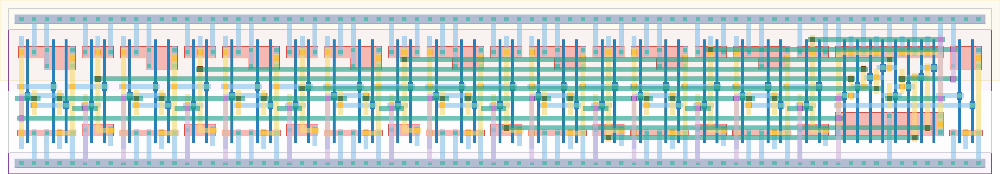

# `dec_8_conf_0` Module


## Cell Hierarchy

`dec_8_conf_0` **50** (number MOS pairs)
- `dec_stage` **5** *x8*
- `nor2` **2**
- `nand4` **4** *x2*

## Netlist

```
.SUBCKT dec_8_conf_0 conf_dec<0> conf_dec<1> conf_dec<2> conf_dec<3> conf_dec<4> conf_dec<5>
                     + conf_dec<6> conf_dec<7> ff_in<0> ff_in<1> ff_in<2> ff_in<3> ff_in<4> ff_in<5>
                     + ff_in<6> ff_in<7> rand_out vdd vss
    Xi28 conf_dec<7> ff_in<7> ff_in<6> stage<7> vdd vss dec_stage
    Xi27 conf_dec<6> ff_in<6> ff_in<5> stage<6> vdd vss dec_stage
    Xi23 conf_dec<5> ff_in<5> ff_in<4> stage<5> vdd vss dec_stage
    Xi22 conf_dec<4> ff_in<4> ff_in<3> stage<4> vdd vss dec_stage
    Xi21 conf_dec<3> ff_in<3> ff_in<2> stage<3> vdd vss dec_stage
    Xi20 conf_dec<2> ff_in<2> ff_in<1> stage<2> vdd vss dec_stage
    Xi19 conf_dec<1> ff_in<1> ff_in<0> stage<1> vdd vss dec_stage
    Xi18 conf_dec<0> ff_in<0> ff_in<7> stage<0> vdd vss dec_stage
    Xi26 net026 net023 rand_out vdd vss nor2
    Xi25 stage<4> stage<5> stage<6> stage<7> net023 vdd vss nand4
    Xi24 stage<0> stage<1> stage<2> stage<3> net026 vdd vss nand4
.ENDS
```
