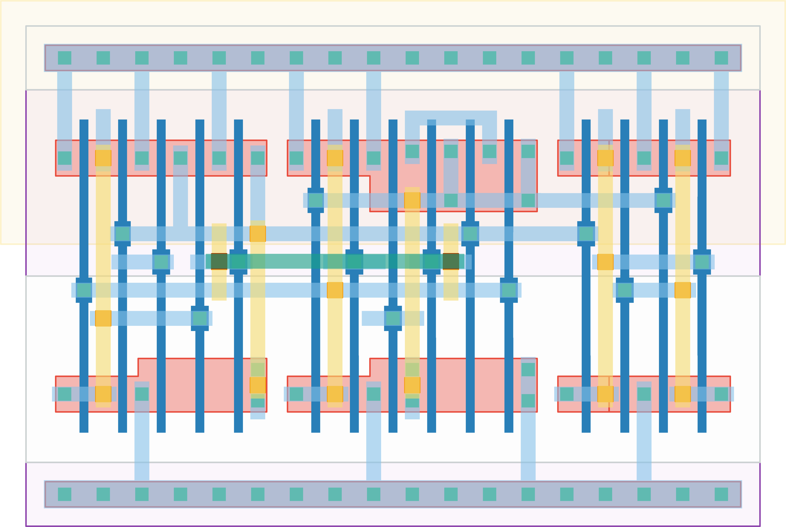

# `dff_st_ar` Module


## Cell Hierarchy

`dff_st_ar` **15** (number MOS pairs)
- `nand2` **2** *x4*
- `nand3` **3**
- `nand3_r` **4**

## Netlist

```
.SUBCKT dff_st_ar CLK D Q Q' RST RST' VDD VSS
    Xi5 Q N1 Q' VDD VSS nand2
    Xi4 N0 Q' Q VDD VSS nand2
    Xi3 N1 D N3 VDD VSS nand2
    Xi0 N3 N0 N2 VDD VSS nand2
    Xi1 CLK N2 RST' N0 VDD VSS nand3
    Xi2 CLK N0 N3 N1 RST VDD VSS nand3_r
.ENDS
```
