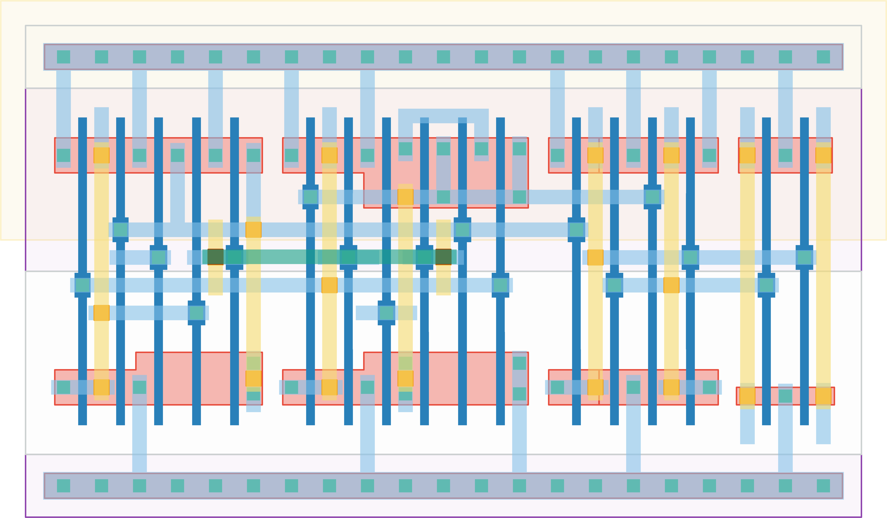

# `dff_st_ar_buf` Module


## Cell Hierarchy

`dff_st_ar_buf` **17** (number MOS pairs)
- `dff_st_ar` **15**
- `inv` **1** *x2*

## Netlist

```
.SUBCKT dff_st_ar_buf clk d q q' rst rst' vdd vss
    Xi0 clk d net17 net18 rst rst' vdd vss dff_st_ar
    Xi2 net17 q' vdd vss inv
    Xi1 net18 q vdd vss inv
.ENDS
```
