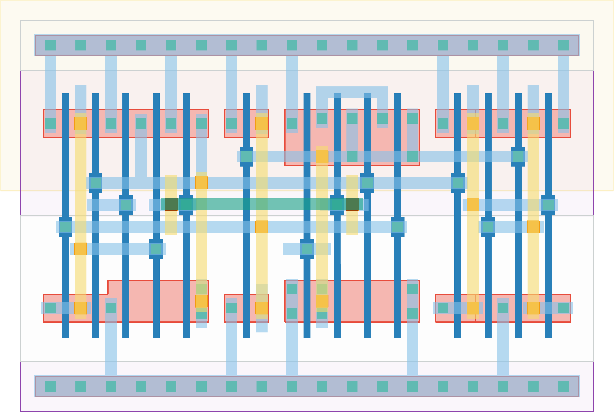

# `dff_st_ar_dh` Module


## Cell Hierarchy

`dff_st_ar_dh` **14** (number MOS pairs)
- `nand2` **2** *x3*
- `nand3` **3**
- `nand3_r` **4**
- `inv_wn` **1**

## Netlist

```
.SUBCKT dff_st_ar_dh clk q q' rst rst' vdd vss
    Xi5 q n1 q' vdd vss nand2
    Xi4 n0 q' q vdd vss nand2
    Xi0 n3 n0 n2 vdd vss nand2
    Xi1 clk n2 rst' n0 vdd vss nand3
    Xi2 clk n0 n3 n1 rst vdd vss nand3_r
    Xi6 n1 n3 vdd vss inv_wn
.ENDS
```
