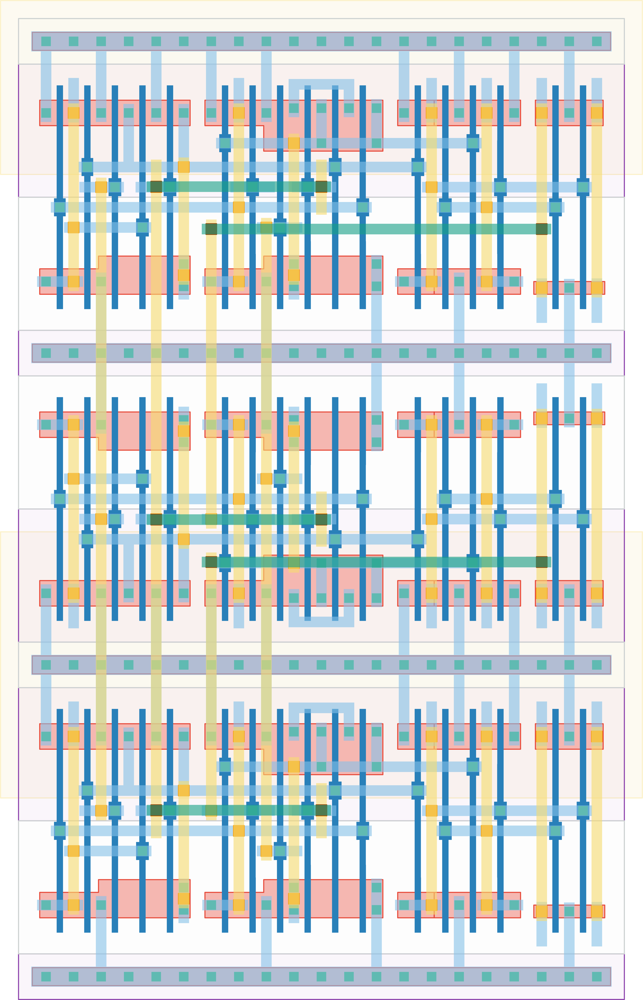

# `edge_to_level_3e` Module


## Cell Hierarchy

`edge_to_level_3e` **51** (number MOS pairs)
- `dff_st_ar_buf` **17** *x3*

## Netlist

```
.SUBCKT edge_to_level_3e edge enable out0 out1 out2 rst rst' vdd vss
    Xi5 edge out1 out2 net17 rst rst' vdd vss dff_st_ar_buf
    Xi4 edge out0 out1 net18 rst rst' vdd vss dff_st_ar_buf
    Xi3 edge enable out0 net19 rst rst' vdd vss dff_st_ar_buf
.ENDS
```
