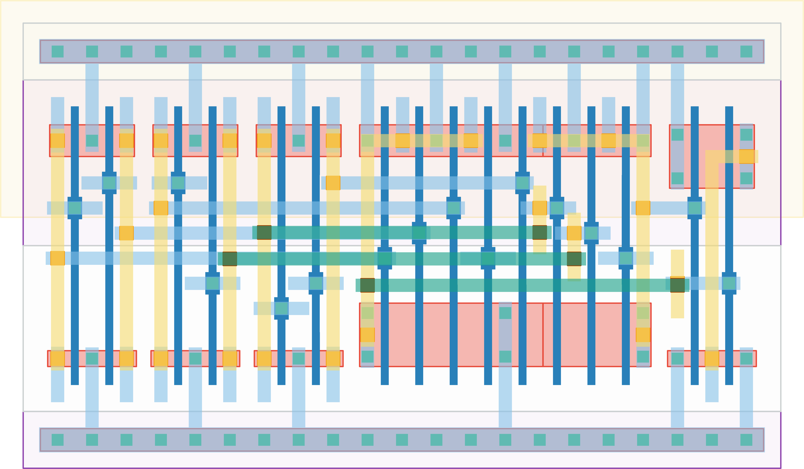

# `equal_to_24` Module


## Cell Hierarchy

`equal_to_24` **16** (number MOS pairs)
- `inv` **1** *x6*
- `nand4` **4** *x2*
- `nor2` **2**

## Netlist

```
.SUBCKT equal_to_24 equal in<0> in<1> in<2> in<3> in<4> in<5> in<6> in<7> vdd vss
    Xi5 in<7> in'<7> vdd vss inv
    Xi4 in<6> in'<6> vdd vss inv
    Xi3 in<5> in'<5> vdd vss inv
    Xi2 in<2> in'<2> vdd vss inv
    Xi1 in<1> in'<1> vdd vss inv
    Xi0 in<0> in'<0> vdd vss inv
    Xi7 in<4> in'<5> in'<6> in'<7> net11 vdd vss nand4
    Xi6 in'<0> in'<1> in'<2> in<3> net12 vdd vss nand4
    Xi8 net12 net11 equal vdd vss nor2
.ENDS
```
