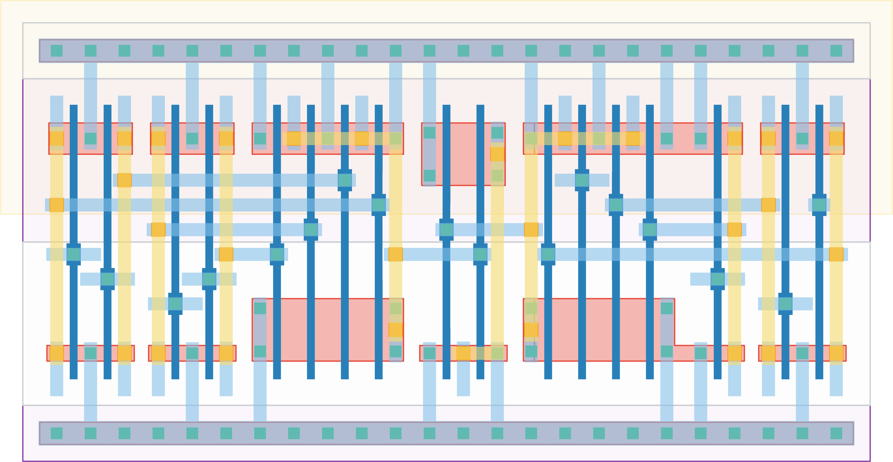

# `equal_to_32` Module


## Cell Hierarchy

`equal_to_32` **17** (number MOS pairs)
- `inv` **1** *x7*
- `nand4` **4** *x2*
- `nor2` **2**

## Netlist

```
.SUBCKT equal_to_32 equal in<0> in<1> in<2> in<3> in<4> in<5> in<6> in<7> vdd vss
    Xi8 in<4> in'<4> vdd vss inv
    Xi7 in<6> in'<6> vdd vss inv
    Xi6 in<7> in'<7> vdd vss inv
    Xi5 in<3> in'<3> vdd vss inv
    Xi3 in<1> in'<1> vdd vss inv
    Xi4 in<2> in'<2> vdd vss inv
    Xi0 in<0> in'<0> vdd vss inv
    Xi10 in'<4> in<5> in'<6> in'<7> net013 vdd vss nand4
    Xi9 in'<0> in'<1> in'<2> in'<3> net014 vdd vss nand4
    Xi11 net014 net013 equal vdd vss nor2
.ENDS
```
