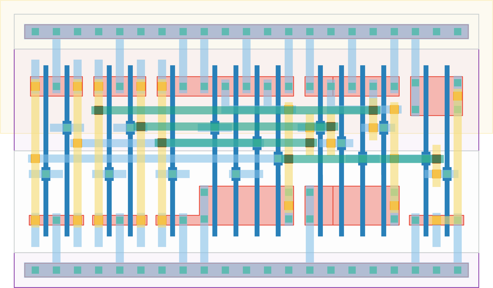

# `equal_to_52` Module


## Cell Hierarchy

`equal_to_52` **15** (number MOS pairs)
- `inv` **1** *x5*
- `nand4` **4** *x2*
- `nor2` **2**

## Netlist

```
.SUBCKT equal_to_52 equal in<0> in<1> in<2> in<3> in<4> in<5> in<6> in<7> vdd vss
    Xi4 in<0> in'<0> vdd vss inv
    Xi3 in<1> in'<1> vdd vss inv
    Xi2 in<3> in'<3> vdd vss inv
    Xi1 in<6> in'<6> vdd vss inv
    Xi0 in<7> in'<7> vdd vss inv
    Xi6 in'<3> in<2> in'<1> in'<0> net7 vdd vss nand4
    Xi5 in'<7> in'<6> in<5> in<4> net8 vdd vss nand4
    Xi7 net8 net7 equal vdd vss nor2
.ENDS
```
