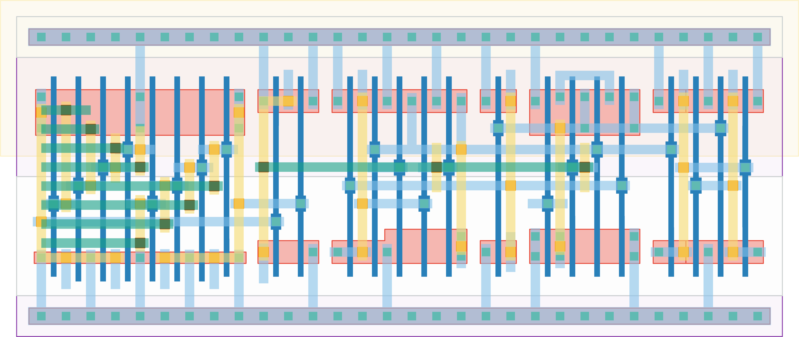

# `ff_ready_4` Module


## Cell Hierarchy

`ff_ready_4` **24** (number MOS pairs)
- `nand2` **2**
- `dff_st_ar_dh` **14**
- `nor4` **4** *x2*

## Netlist

```
.SUBCKT ff_ready_4 ff0<0> ff0<1> ff0<2> ff0<3> ff1<0> ff1<1> ff1<2> ff1<3> ff_ready rst rst' vdd vss
    Xi2 ff_nor0 ff_nor1 ff_nand vdd vss nand2
    Xi3 ff_nand ff_ready net18 rst rst' vdd vss dff_st_ar_dh
    Xi0 ff0<0> ff0<1> ff0<2> ff0<3> ff_nor0 vdd vss nor4
    Xi1 ff1<0> ff1<1> ff1<2> ff1<3> ff_nor1 vdd vss nor4
.ENDS
```
