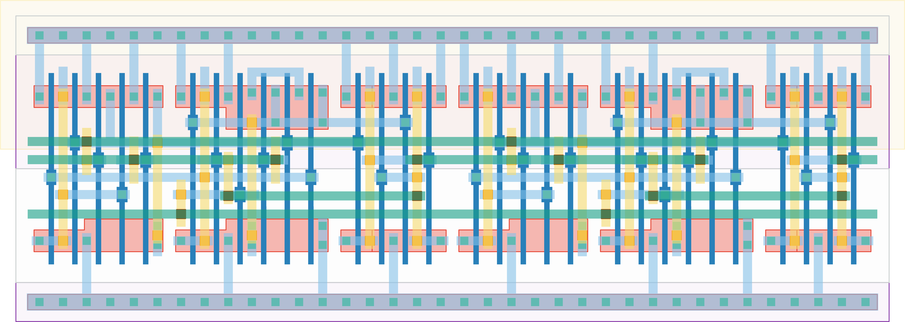

# `freq_scaler2` Module


## Cell Hierarchy

`freq_scaler2` **30** (number MOS pairs)
- `tff_st_ar` **15** *x2*

## Netlist

```
.SUBCKT freq_scaler2 clk out<0> out<1> q' rst rst' vdd vss
    Xi1 int out<1> q' rst rst' vdd vss tff_st_ar
    Xi0 clk out<0> int rst rst' vdd vss tff_st_ar
.ENDS
```
