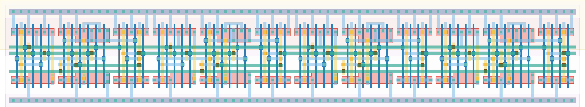

# `freq_scaler4` Module


## Cell Hierarchy

`freq_scaler4` **60** (number MOS pairs)
- `freq_scaler2` **30** *x2*

## Netlist

```
.SUBCKT freq_scaler4 clk out<0> out<1> out<2> out<3> q' rst rst' vdd vss
    Xi1 net17 out<2> out<3> q' rst rst' vdd vss freq_scaler2
    Xi0 clk out<0> out<1> net17 rst rst' vdd vss freq_scaler2
.ENDS
```
