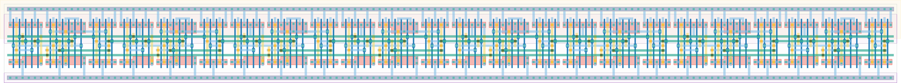

# `freq_scaler8` Module


## Cell Hierarchy

`freq_scaler8` **120** (number MOS pairs)
- `freq_scaler4` **60** *x2*

## Netlist

```
.SUBCKT freq_scaler8 clk out<0> out<1> out<2> out<3> out<4> out<5> out<6> out<7> q' rst rst' vdd vss
    Xi1 net17 out<4> out<5> out<6> out<7> q' rst rst' vdd vss freq_scaler4
    Xi0 clk out<0> out<1> out<2> out<3> net17 rst rst' vdd vss freq_scaler4
.ENDS
```
