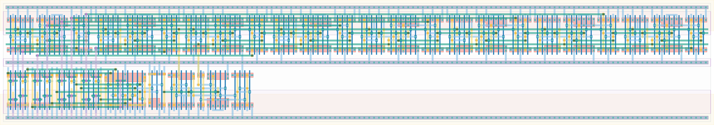

# `max_ready` Module


## Cell Hierarchy

`max_ready` **161** (number MOS pairs)
- `async_counter_8` **120**
- `nand2` **2** *x8*
- `nand4` **4** *x2*
- `nor2` **2**
- `inv` **1**
- `dff_st_ar_dh` **14**

## Netlist

```
.SUBCKT max_ready conf_maxcycles<0> conf_maxcycles<1> conf_maxcycles<2> conf_maxcycles<3>
                  + conf_maxcycles<4> conf_maxcycles<5> conf_maxcycles<6> conf_maxcycles<7> int
                  + max_ready rst rst' vdd vss
    Xi0 int cnt<0> cnt<1> cnt<2> cnt<3> cnt<4> cnt<5> cnt<6> cnt<7> net020 rst rst' vdd vss
        + async_counter_8
    Xi8 cnt<7> conf_maxcycles<7> cnt_high<7> vdd vss nand2
    Xi7 cnt<6> conf_maxcycles<6> cnt_high<6> vdd vss nand2
    Xi6 cnt<5> conf_maxcycles<5> cnt_high<5> vdd vss nand2
    Xi5 cnt<4> conf_maxcycles<4> cnt_high<4> vdd vss nand2
    Xi4 cnt<3> conf_maxcycles<3> cnt_high<3> vdd vss nand2
    Xi3 cnt<2> conf_maxcycles<2> cnt_high<2> vdd vss nand2
    Xi2 cnt<1> conf_maxcycles<1> cnt_high<1> vdd vss nand2
    Xi1 cnt<0> conf_maxcycles<0> cnt_high<0> vdd vss nand2
    Xi10 cnt_high<4> cnt_high<5> cnt_high<6> cnt_high<7> net09 vdd vss nand4
    Xi9 cnt_high<0> cnt_high<1> cnt_high<2> cnt_high<3> net010 vdd vss nand4
    Xi11 net010 net09 net021 vdd vss nor2
    Xi12 net021 ready vdd vss inv
    Xi13 ready max_ready net018 rst rst' vdd vss dff_st_ar_dh
.ENDS
```
