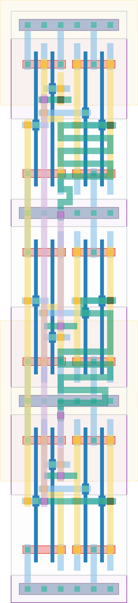

# `mero_3e_1b` Module


## Cell Hierarchy

`mero_3e_1b` **12** (number MOS pairs)
- `mero_nand2` **2** *x3*
- `mero_buf` **2** *x3*

## Netlist

```
.SUBCKT mero_3e_1b enable out0 out1 out2 vdd vss
    Xi2 out1 enable net5 vdd vss mero_nand2
    Xi1 out0 enable net6 vdd vss mero_nand2
    Xi0 out2 enable net7 vdd vss mero_nand2
    Xi5 net5 out2 vdd vss mero_buf
    Xi4 net6 out1 vdd vss mero_buf
    Xi3 net7 out0 vdd vss mero_buf
.ENDS
```
