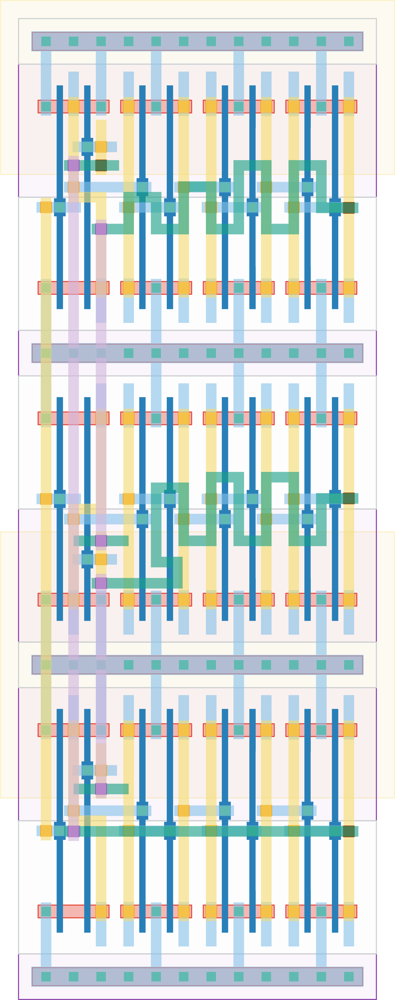

# `mero_3e_3b` Module


## Cell Hierarchy

`mero_3e_3b` **24** (number MOS pairs)
- `mero_nand2` **2** *x3*
- `mero_buf` **2** *x9*

## Netlist

```
.SUBCKT mero_3e_3b enable out0 out1 out2 vdd vss
    Xi2 out1 enable int2<0> vdd vss mero_nand2
    Xi1 out0 enable int1<0> vdd vss mero_nand2
    Xi0 out2 enable int0<0> vdd vss mero_nand2
    Xi14 int2<2> out2 vdd vss mero_buf
    Xi13 int1<2> out1 vdd vss mero_buf
    Xi12 int0<2> out0 vdd vss mero_buf
    Xi8 int2<1> int2<2> vdd vss mero_buf
    Xi7 int2<0> int2<1> vdd vss mero_buf
    Xi6 int1<1> int1<2> vdd vss mero_buf
    Xi5 int1<0> int1<1> vdd vss mero_buf
    Xi4 int0<1> int0<2> vdd vss mero_buf
    Xi3 int0<0> int0<1> vdd vss mero_buf
.ENDS
```
