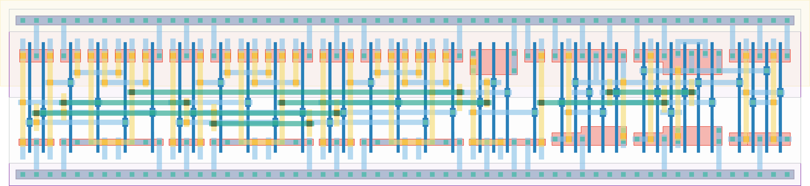

# `mero_collapse_3e` Module


## Cell Hierarchy

`mero_collapse_3e` **37** (number MOS pairs)
- `xor2` **6** *x3*
- `inv` **1**
- `nor3` **3**
- `dff_st_ar` **15**

## Netlist

```
.SUBCKT mero_collapse_3e alarm enable_e2l int0 int1 int2 rst rst' vdd vss
    Xi2 int2 int1 xor2 vdd vss xor2
    Xi1 int0 int2 xor1 vdd vss xor2
    Xi0 int1 int0 xor0 vdd vss xor2
    Xi7 nor or vdd vss inv
    Xi4 xor0 xor1 xor2 nor vdd vss nor3
    Xi6 enable_e2l or alarm net016 rst rst' vdd vss dff_st_ar
.ENDS
```
