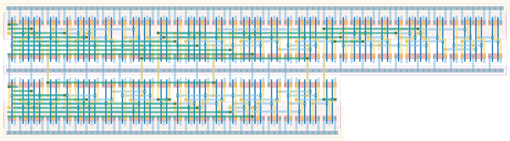

# `mux16` Module


## Cell Hierarchy

`mux16` **105** (number MOS pairs)
- `mux4` **21** *x5*

## Netlist

```
.SUBCKT mux16 IN<0> IN<1> IN<2> IN<3> IN<4> IN<5> IN<6> IN<7> IN<8> IN<9> IN<10> IN<11> IN<12>
              + IN<13> IN<14> IN<15> OUT SEL<0> SEL<1> SEL<2> SEL<3> VDD VSS
    Xi4 IN<12> IN<13> IN<14> IN<15> INT<3> SEL<0> SEL<1> VDD VSS mux4
    Xi3 IN<8> IN<9> IN<10> IN<11> INT<2> SEL<0> SEL<1> VDD VSS mux4
    Xi5 INT<0> INT<1> INT<2> INT<3> OUT SEL<2> SEL<3> VDD VSS mux4
    Xi1 IN<4> IN<5> IN<6> IN<7> INT<1> SEL<0> SEL<1> VDD VSS mux4
    Xi0 IN<0> IN<1> IN<2> IN<3> INT<0> SEL<0> SEL<1> VDD VSS mux4
.ENDS
```
